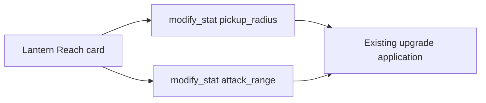
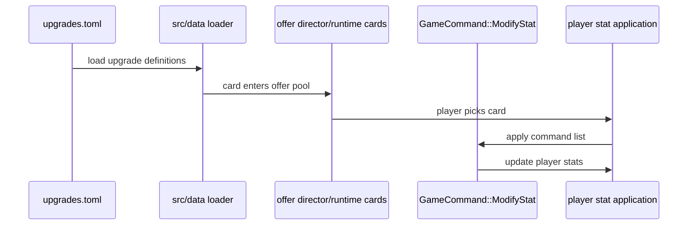
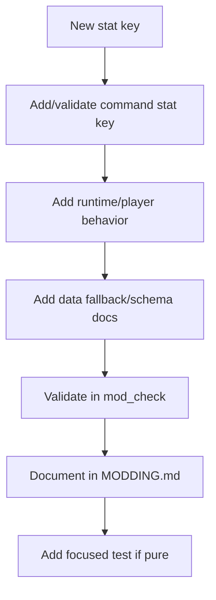

This example adds a tiny moddable feature: a new level-up card that changes existing player stats.

It uses existing architecture:

- data file: `Assets/Data/upgrades.toml`
- existing command: `modify_stat`
- existing validation: `mod_check`
- existing runtime application: level-up card pick logic

## What We Are Building

A card named `Lantern Reach`:

- increases pickup radius
- slightly increases attack range
- stacks twice
- needs no Rust change



## Step 1: Find The Data File

Level-up cards live in:

```text
Assets/Data/upgrades.toml
```

Each card is a `[[upgrade]]` table. Existing examples show two supported effect styles:

- legacy `[[upgrade.effects]]`
- shared command shape under `[[upgrade.commands]]`

For new cards, prefer commands when the existing command vocabulary supports the behavior.

## Step 2: Add The Card

Add this to `Assets/Data/upgrades.toml` in a real contribution:

```toml
[[upgrade]]
id           = "lantern_reach"
display_name = "Lantern Reach"
subtitle     = "The light finds what the hand cannot."
icon         = "deep_roots"
kind         = "Passive"
rarity       = "Common"
description  = "+24 pickup radius and +20 attack range."
max_stacks   = 2

[[upgrade.commands]]
cmd   = "modify_stat"
stat  = "pickup_radius"
delta = 24.0

[[upgrade.commands]]
cmd   = "modify_stat"
stat  = "attack_range"
delta = 20.0
```

This example reuses the `deep_roots` icon so there is no new asset to package. A real card should eventually get its own icon if the visual vocabulary needs it.

## Step 3: Understand The Flow



The card is "moddable" because changing the TOML changes the game without recompiling Rust.

## Step 4: Verify

Run:

```powershell
cargo run --bin mod_check
```

This should catch:

- malformed TOML
- duplicate ids
- invalid command payloads
- unknown stat keys
- bad icon references where validation applies

Then confirm release discovery:

```powershell
cargo run --bin asset_pack -- --dry-run --list
```

Because this example edits `Assets/Data/upgrades.toml`, it is automatically discoverable.

Finally, smoke-test the runtime:

```powershell
cargo run
```

You are checking that the game starts and the card can appear during level-up. Offer selection is scored, so a card may not appear immediately every run.

## When This Stops Being Data-Only

The example stays data-only because `pickup_radius` and `attack_range` already exist.

If you wanted a brand-new stat, such as:

```toml
stat = "lantern_glow_radius"
```

then the work would become a Rust-backed slice:



That is still a good contribution, but it is not the first exercise.

## What To Commit

For a real data-only card contribution, commit:

- the data change
- any modding docs update if the card demonstrates a new pattern
- verification notes

Do not bundle unrelated runtime refactors with a tiny content feature.
