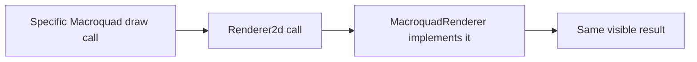
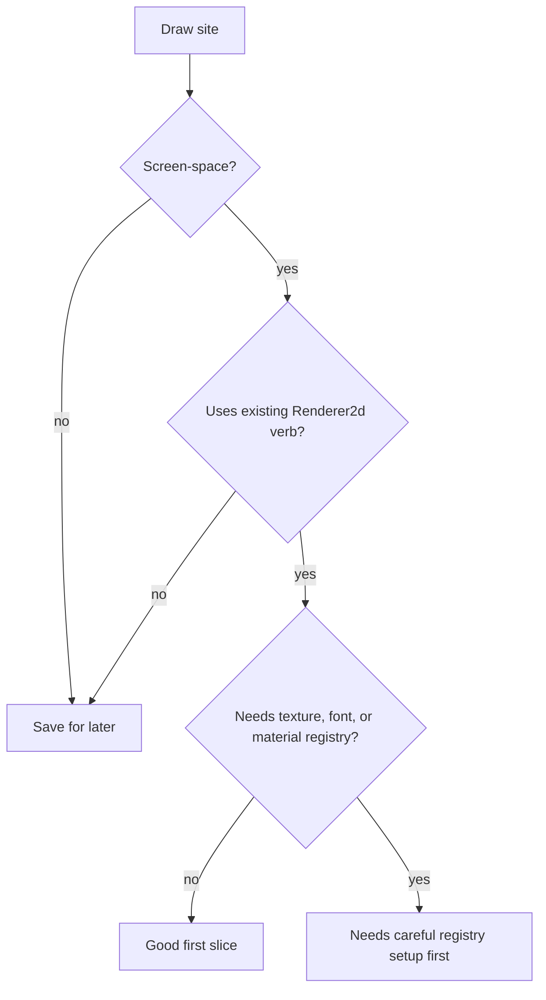
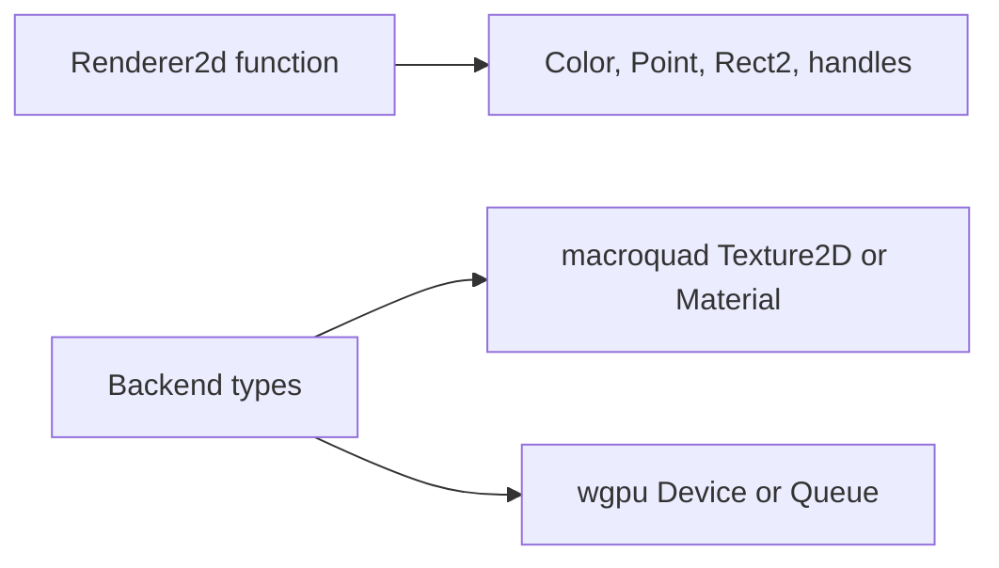

This tutorial is for a beginner who wants to help with the renderer migration without touching Vulkan directly.

Your first renderer contribution should not be a backend rewrite. It should be one small draw site moved behind the neutral `Renderer2d` boundary, while Macroquad output stays the same.

The renderer project lives at [soulwax/vk2d](https://github.com/soulwax/vk2d). EchoWarrior keeps it checked out as the `crates/vk2d` submodule so contributors can test the game and renderer together without pretending the game repo owns renderer internals.

## The Goal



The success condition is boring: the screen should look the same, but the code now talks to the renderer boundary.

## Files To Know

| File | Why you read it |
| --- | --- |
| `src/render.rs` | The neutral trait and value types. |
| `src/runtime/renderer_mq.rs` | How neutral calls become Macroquad calls. |
| `src/runtime/overlays.rs` | Example of a small screen-space panel going through `MacroquadRenderer`. |
| `src/ui/layout.rs` | Shared rectangle type used by neutral rendering. |
| `src/bin/wgpu_probe.rs` | Isolated Vulkan smoke entry point. |
| `crates/vk2d/README.md` | The local submodule checkout of the standalone `soulwax/vk2d` renderer direction. |

If the checkout is fresh, initialize the renderer submodule first:

```powershell
git submodule update --init crates/vk2d
```

## Pick A Good First Target

Good first targets are screen-space and simple:

- a rectangle panel background
- a panel outline
- a short line or divider
- a simple label whose font handling is already nearby

Avoid these for a first slice:

- world-space actors
- camera-dependent sprite transforms
- shader-heavy VFX
- post-processing
- anything that depends on render-target flipping

## Decision Flow



The easiest first win is a rectangle or outline. It proves the boundary without making asset handles part of the task.

## Step 1: Read The Neutral Verb

Open:

```text
src/render.rs
```

Find the method you want:

```rust
fn fill_rect(&mut self, rect: Rect2, color: Color);
fn rect_outline(&mut self, rect: Rect2, thickness: f32, color: Color);
fn line(&mut self, from: Point, to: Point, thickness: f32, color: Color);
```

Use the existing verbs. Do not add a new trait method unless the current vocabulary truly cannot express the draw.

## Step 2: Read The Macroquad Adapter

Open:

```text
src/runtime/renderer_mq.rs
```

Check how the method maps to Macroquad. For example:

```rust
fn fill_rect(&mut self, rect: Rect2, color: RColor) {
    draw_rectangle(rect.x, rect.y, rect.w, rect.h, mq_color(color));
}
```

That tells you the coordinate convention: the neutral API uses screen-space top-left rectangles for these UI-style calls.

## Step 3: Convert One Draw Site

The small pattern looks like this:

```rust
use echo_warrior::render::{Color, Rect2, Renderer2d};

fn draw_panel(renderer: &mut dyn Renderer2d, rect: Rect2, alpha: f32) {
    renderer.fill_rect(rect, Color::rgba(0.04, 0.06, 0.08, alpha));
    renderer.rect_outline(rect, 2.0, Color::rgba(0.84, 0.63, 0.37, alpha));
}
```

Keep the conversion local. A first slice should not redesign panel ownership, load assets, or change runtime state.

## Step 4: Keep Backend Types Out

This is the main beginner trap.



If a helper takes `macroquad::Color`, it is still Macroquad-specific. If it takes `echo_warrior::render::Color`, it can be implemented by Macroquad today and `vk2d` later.

## Step 5: Verify The Right Thing

For a Macroquad-boundary slice:

```powershell
cargo check
cargo run
```

If you touched `crates/vk2d` or the probe:

```powershell
cargo test -p vk2d
cargo run -p vk2d --example hello_sprite -- --frames 3
cargo run --bin wgpu_probe -- --frames 3
```

If you only moved a tiny screen-space rectangle through `Renderer2d`, `cargo check` plus a visual `cargo run` smoke test is usually the right first gate.

## Step 6: Watch The Submodule Boundary

A first boundary slice should normally leave `crates/vk2d` untouched. If `git status --short` in the parent repo shows `m crates/vk2d`, stop and check whether you intentionally changed the renderer checkout.

```powershell
git status --short
git -C crates/vk2d status --short
git submodule status crates/vk2d
```

Only bump the parent submodule pointer after a renderer-library commit has been made and pushed in `soulwax/vk2d`.

## What A Good First PR Says

Use a small summary:

```text
Moved the run reward panel background through Renderer2d.

The Macroquad backend still renders the same rectangles and outlines, but the
draw site now depends on the neutral renderer boundary instead of direct
Macroquad primitives.
```

That tells reviewers the important thing: behavior stayed stable, but the migration moved one step forward.

## Next Tutorial

After this, read [Vulkan Renderer Path](../architecture/vulkan-renderer-path/) to understand how the same neutral draw vocabulary connects to `vk2d` and the `wgpu_probe`, then read [Renderer Submodule Workflow](../renderer-submodule-workflow/) before touching the renderer crate itself.
