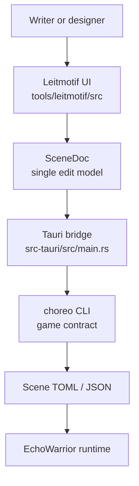

<figure class="wide-figure">
  
  <figcaption>Leitmotif is the choreography authoring surface: sequences on the left, live stage in the center, ordered steps and parallel beats below, and the selected beat inspector on the right.</figcaption>
</figure>

Leitmotif is the EchoWarrior scene director. It is a Tauri desktop app with a Vite and TypeScript frontend, built so writers can compose choreography without editing Rust or hand-writing every TOML beat.

It belongs to the choreography pipeline, not the runtime renderer. The app authors scene data, asks the game's `choreo` CLI to validate, preview, convert, and graph it, then exports TOML the game can play.

## Identity

  <figure class="mark-figure">
    
    <figcaption>The Leitmotif icon is a lantern flame in fog: a small, readable symbol for authored story light inside the game's darker scene language.</figcaption>
  </figure>
  <figure>
    
    <figcaption>The action picker mixes deterministic suggestions with the full beat vocabulary, so a writer can start from a likely next move but still choose deliberately.</figcaption>
  </figure>

## What It Owns

Leitmotif owns authoring ergonomics:

- scene and sequence selection
- the beat timeline and drag/reorder operations
- schema-driven beat and trigger forms
- project-level story graph loading
- deterministic suggestions and fix suggestions
- save, validate, preview, convert, and export flows through `choreo`

The game still owns the contract. If the Rust choreography types or `choreo` behavior change, Leitmotif follows that contract instead of inventing a second one.

## First Mental Model

A newcomer can read Leitmotif as three layers:

| Layer | Main files | Job |
| --- | --- | --- |
| Document model | `src/scene.ts`, `src/project.ts` | Own loaded scene state, dirty tracking, undo/redo, project scene maps. |
| Editor surface | `src/main.ts`, `src/timeline.ts`, `src/form.ts`, `src/trigger.ts`, `src/stage.ts`, `src/story.ts` | Render the editor and route user actions into `SceneDoc`. |
| Contract bridge | `src/bridge.ts`, `src-tauri/src/main.rs`, `contract/choreography.schema.json` | Talk to the game only through `choreo` and the generated schema. |

## Contributor Entry Points

Start here if you are new:

1. [Getting Started](leitmotif/getting-started/) to run the app and understand the dev modes.
2. [Architecture](leitmotif/architecture/) to see the document, UI, bridge, and CLI boundaries.
3. [Screenshots](leitmotif/screenshots/) to connect the visual surface to the code.
4. [Contributor Slices](leitmotif/contributor-slices/) for small, practical changes.

## Rule Of Thumb

When adding a Leitmotif feature, keep the authoring model boring and reliable:

- mutate scene content through `SceneDoc`
- keep native file and CLI access behind the bridge
- derive forms from schema or curated vocabulary
- make suggestions valid by construction
- degrade gracefully when Tauri or `choreo` is unavailable

