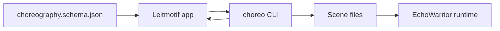
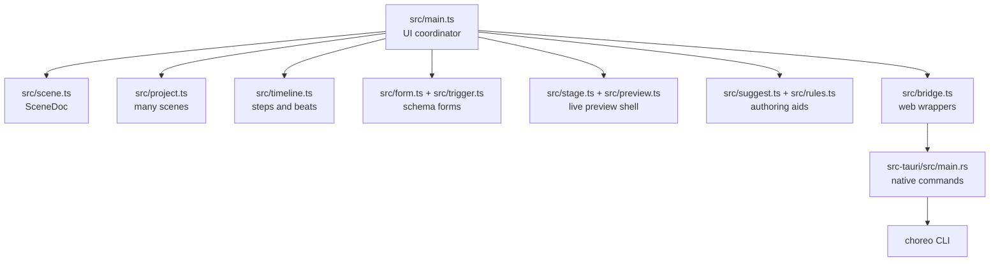
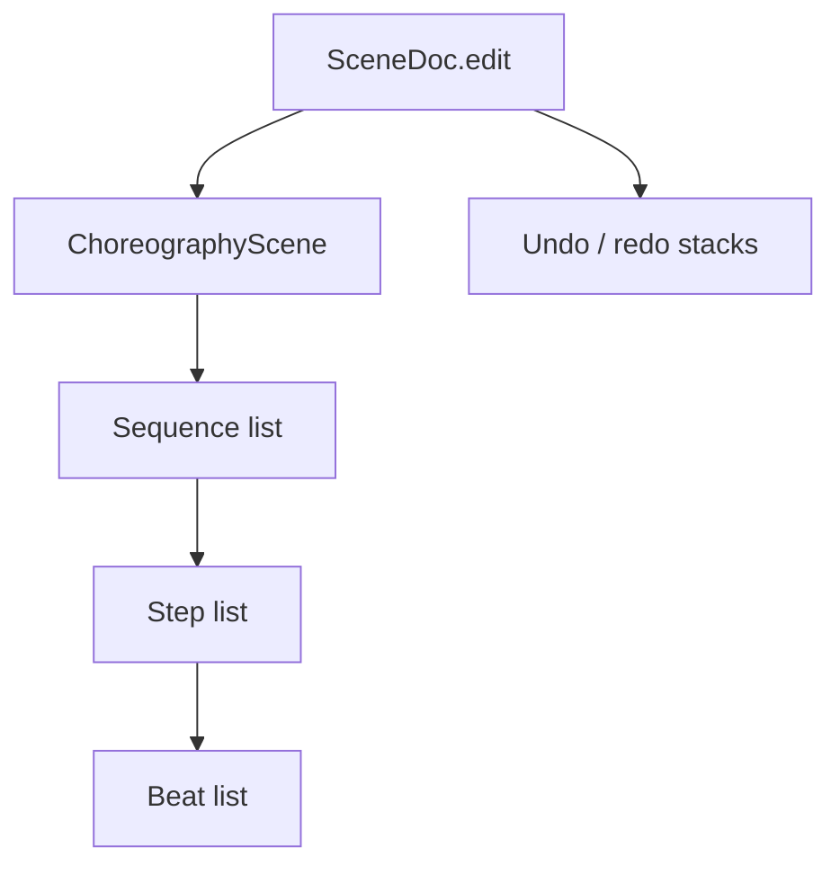
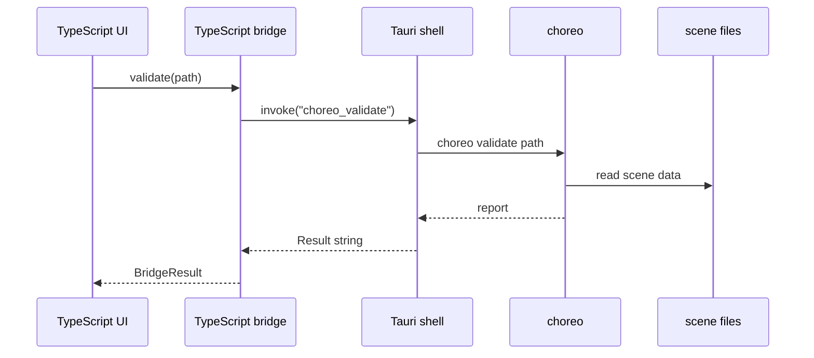

Leitmotif is a thin authoring app around the game's choreography contract. Its best design property is that the UI never becomes a second game engine.

## Big Picture



The app reads schema metadata, edits a scene document, and asks `choreo` for authoritative operations:

- `validate`
- `validate --json`
- `convert`
- `schema`
- `preview`
- `assets`
- `graph`

## Main Layers



`src/main.ts` is deliberately busy because it is the editor coordinator. The important boundary is that it routes mutations into `SceneDoc` instead of letting each component own divergent scene state.

## Document Model

`SceneDoc` mirrors the choreography contract:



Contributor rule: every meaningful content mutation should go through `SceneDoc.edit()` or a helper that calls it, such as `addBeat`, `replaceBeat`, `moveBeat`, `addStep`, or `moveStep`.

This keeps dirty tracking, undo/redo, and UI refreshes predictable.

## Bridge Boundary



The browser-side bridge degrades when Tauri is unavailable. The native side degrades when `CHOREO_BIN` is missing by returning a clear error string. Both choices matter: authors should see a problem, not lose work.

## Suggestions

```mermaid
flowchart LR
    ctx[SuggestContext]
    engine[suggestions()]
    providers[SuggestionProvider list]
    rules[RuleProvider]
    merged[deduped ranked suggestions]
    doc[SceneDoc apply()]

    ctx --> engine
    engine --> providers
    providers --> rules
    rules --> merged
    merged --> doc
```

The current suggestion layer is deterministic and offline. `src/suggest.ts` owns the provider contract, timeout behavior, de-duplication, and ranking. `src/rules.ts` registers the rule provider and creates valid-by-construction suggestions from known beat vocabulary, actors, sfx ids, and validation findings.

An LLM provider can be added later behind the same provider interface, but the rules-only floor must remain useful.

## Story Graph

Project mode loads a folder of scene files:

```mermaid
flowchart TB
    folder[Scene folder]
    project[Project.open]
    list[listSceneDir]
    docs[SceneDoc map]
    graph[choreo graph --json]
    canvas[story canvas]
    sidecar[.leitmotif/layout.json]

    folder --> project
    project --> list
    list --> docs
    project --> graph
    graph --> canvas
    sidecar --> canvas
```

`Project` composes `SceneDoc` instances. It does not add a second mutation model for scene internals. The graph canvas can create, rename, duplicate, delete, and arrange scene nodes, while individual scene edits still belong to `SceneDoc`.

## Contributor Checklist

Before changing architecture-sensitive code, ask:

- Does this keep `choreo` as the source of truth?
- Does this mutation go through `SceneDoc`?
- Does this degrade cleanly in web-only mode?
- Does this stay testable without the desktop shell?
- Does the UI still make invalid export hard?
