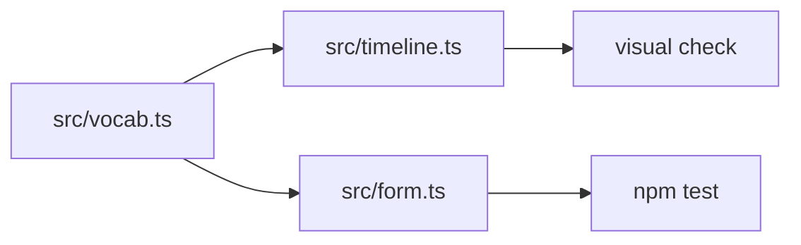
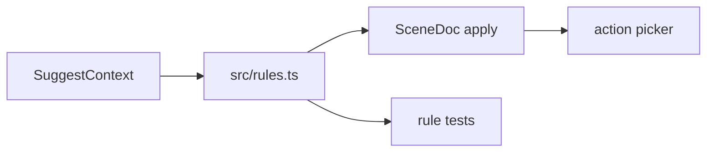
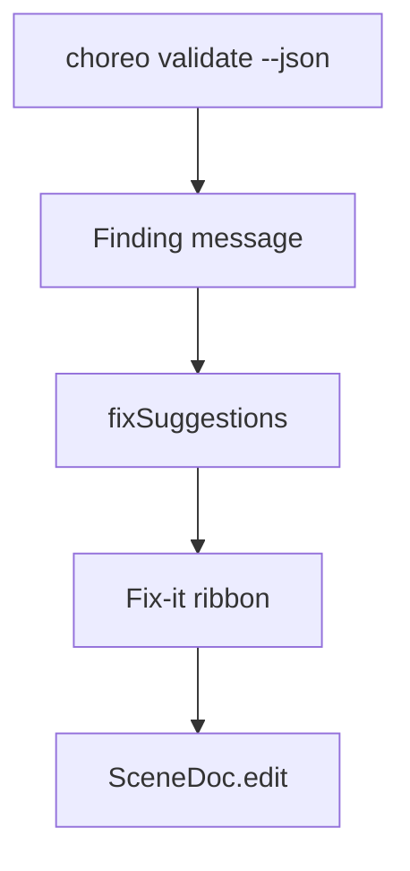
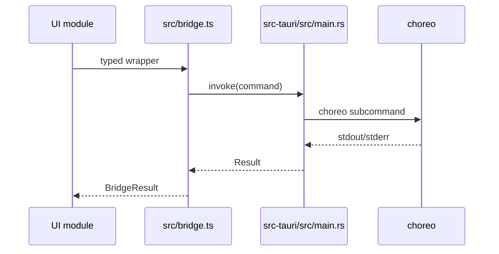
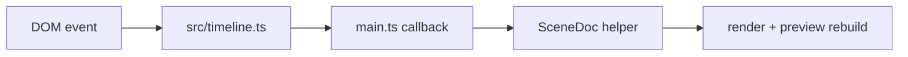

These are deliberately small examples for a new contributor. Pick one only after you can run the web shell and tests.

## Slice 1: Add A Beat Verb Label

Use this when the engine already knows a beat verb, but the editor needs friendlier language or field relevance.

Route:



Steps:

1. Read `src/vocab.ts`.
2. Confirm the verb exists in the generated choreography schema or the engine contract.
3. Add or refine the label, field relevance, and enum hints.
4. Open `npm run dev`.
5. Load a test scene through the dev seam or a Tauri-opened file.
6. Verify the action picker and inspector show the intended wording.
7. Run `npm test`.

Keep this slice UI-only. Do not add a new engine beat from the editor side.

## Slice 2: Add A Deterministic Suggestion

Use this when a writer repeatedly needs a natural next action.

Route:



Implementation shape:

```ts
out.push({
  id: `next:face:${actor}:${beats.length}`,
  kind: "beat",
  confidence: 0.6,
  label: `${actor} turns to face`,
  apply: appendBeat(ctx.seqId, ctx.stepIndex, {
    actor,
    do: "face",
    direction: "down",
  }),
});
```

Rules:

- suggestions should be valid by construction
- `apply` must mutate through `SceneDoc`
- provider failures must not break the editor
- confidence should rank helpful defaults above broad fallback ideas

## Slice 3: Add A Fix-It Case

Use this when `choreo validate --json` reports a pattern the editor can safely repair.

Route:



Good fix-it cases are narrow and reversible:

- qualify a bare sequence id
- retarget a dangling chain to the nearest known id
- fill a missing optional default when the engine accepts it

Avoid fixes that guess story intent. If the tool cannot know what the writer meant, show the finding as text and let the writer choose.

## Slice 4: Add A Bridge Command

Use this when the game CLI exposes a new authoritative operation that the editor needs.



Steps:

1. Add the Tauri command in `src-tauri/src/main.rs`.
2. Route to `run_choreo()` unless the command is purely local shell work.
3. Register it in `invoke_handler!`.
4. Add a typed wrapper in `src/bridge.ts`.
5. Keep the wrapper returning a graceful fallback in web-only mode.
6. Verify with `npm run build` and a Tauri smoke test.

Do not call `Command::new()` from TypeScript-facing modules or individual UI components.

## Slice 5: Add A Timeline Interaction

Use this when the authoring surface needs a new gesture or command.

Route:



The component should describe what happened. `main.ts` decides how that updates the document, refreshes selection, and rebuilds preview.

