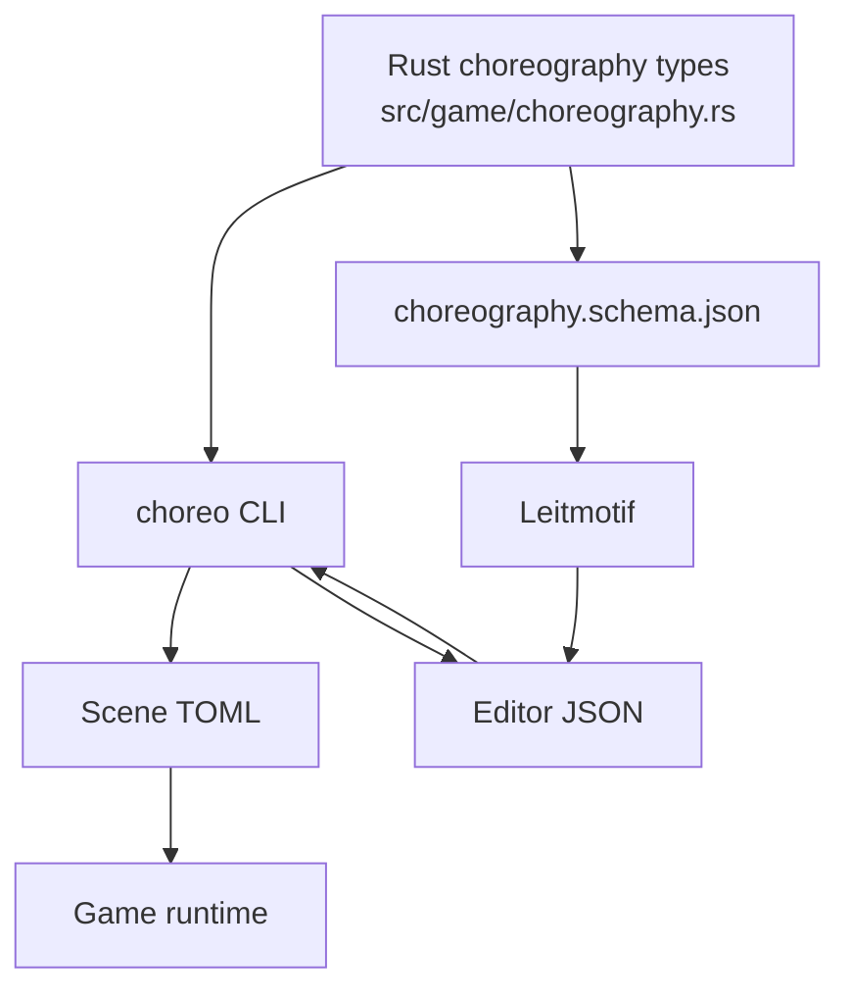
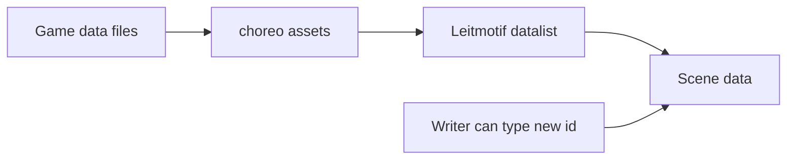
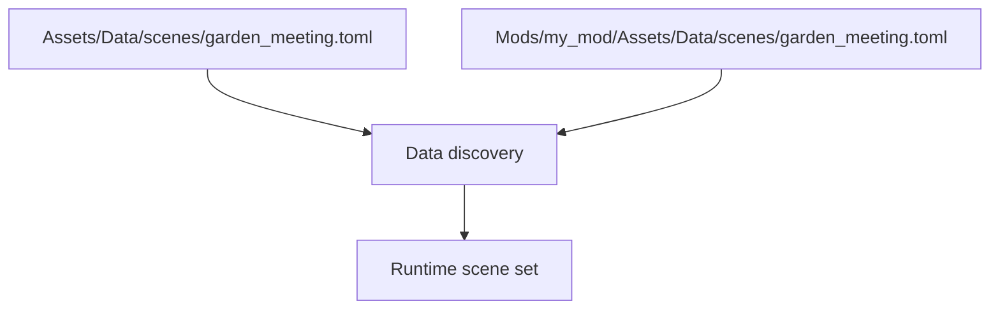
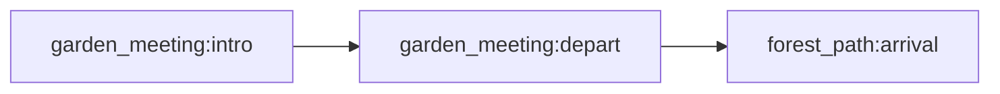
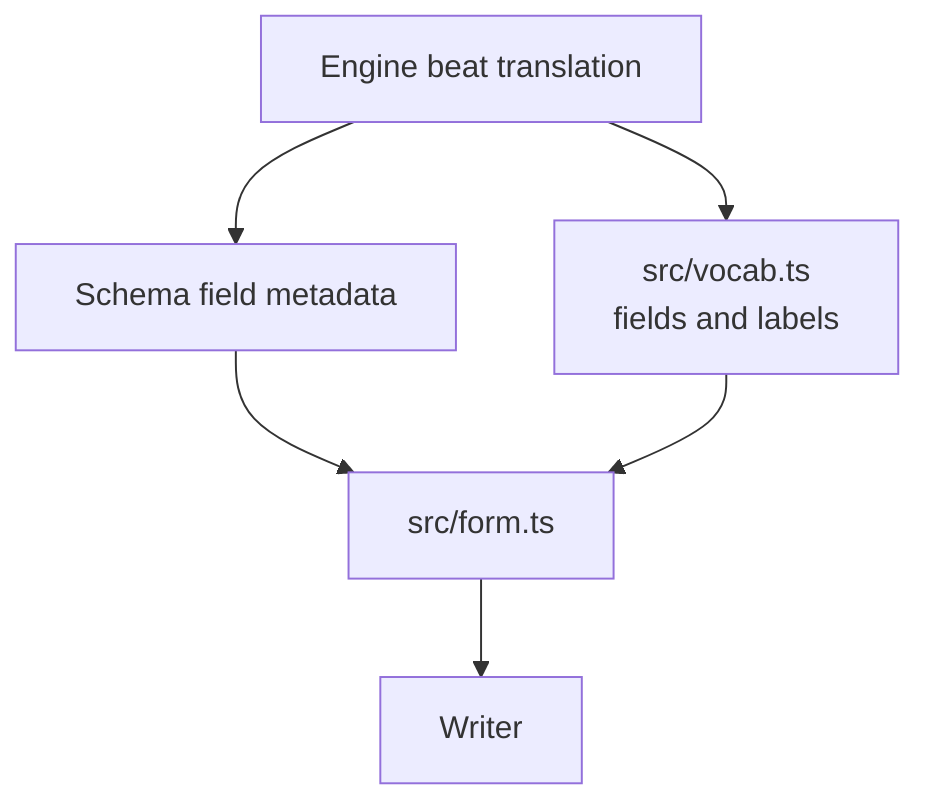

Leitmotif exists because choreography should be moddable content, not hardcoded presentation.

The important idea: the game owns the contract, Leitmotif owns the authoring experience.

## The Contract Triangle



The data model lives in Rust. The CLI converts and validates. The schema describes fields for tools. Leitmotif edits JSON in memory and exports TOML for the game.

This keeps the editor from becoming a second source of truth.

## What Modders Can Change Without Rust

Scene authors and modders should be able to add content through data:

| Content | Typical file |
| --- | --- |
| Scenes and sequences | `Assets/Data/scenes/*.toml` |
| Legacy choreography file | `Assets/Data/choreography.toml` |
| Characters and actor ids | `Assets/Data/characters.toml` |
| Sound effect ids | `Assets/Data/sfx.toml` |
| Weather presets | `Assets/Data/weather_presets.toml` |
| Dialogue hooks | dialogue YAML with `play_sequence:` |
| Lua hooks | `echo_warrior.play_sequence("id")` |

Leitmotif should make these data routes easier to author, not hide them behind app-only state.

## Pick Known Ids, Still Allow New Ones

Leitmotif asks the game for actor and sfx ids through:

```powershell
cargo run --bin choreo -- assets
```

The app uses those ids for datalist suggestions. A writer can still type a new id.



This is important for mods. A mod may add an actor, sfx, weather preset, or future content id that the current base game catalog does not know yet. The editor should guide, not forbid.

## Scene Files And Mods

Base scenes live under:

```text
Assets/Data/scenes/*.toml
```

Mods mirror that path:

```text
Mods/<mod_id>/Assets/Data/scenes/*.toml
```

A mod can add a new scene file or replace a base scene file with the same relative path.



Leitmotif should preserve normal TOML files so mod packaging and `data.pak` discovery keep working.

## Sequence References

Scene files can qualify ids as `scene:sequence`.



Use qualified references when chaining across scene files. Bare ids are convenient inside a small file, but they can become ambiguous once another scene uses the same sequence id.

Validation should catch dangling or ambiguous references before export.

## Beat Vocabulary

The engine understands beat verbs. Leitmotif presents them through `src/vocab.ts`.



The schema gives field types and descriptions. The vocabulary map adds:

- which fields matter for each verb
- friendly hints
- enums for free-string fields such as `direction`, `from`, and `ease`
- which verbs can be placed by clicking the stage

When a new engine beat is added, update the engine first, regenerate or update the schema, then update `src/vocab.ts`.

## Moddable Authoring Examples

### Add A New Scene

```toml
scene = "new_epilogue"

[[sequence]]
id = "opening"
trigger = { kind = "manual" }

[[sequence.step]]
duration = 1.0

[[sequence.step.beat]]
actor = "echo"
do = "say"
text = "We made it back."
```

Start it from dialogue:

```yaml
play_sequence: new_epilogue:opening
```

Or from Lua:

```lua
return echo_warrior.play_sequence("new_epilogue:opening")
```

### Add A New Sfx Usage

If the sfx id already exists in game data, Leitmotif offers it in the picker. If it is mod-added and not yet known to the current catalog, type it anyway:

```toml
[[sequence.step.beat]]
actor = "world"
do = "play_sfx"
id = "my_mod.bell_soft"
```

The validation and runtime data layer decide whether that id is available in the active content set.

### Add A New Weather Beat

```toml
[[sequence.step.beat]]
actor = "world"
do = "set_weather"
preset = "rain_lantern_dusk"
```

The beat stays data-driven. The preset belongs in weather data, not in the editor.

## Graceful Degradation

| Missing piece | Expected behavior |
| --- | --- |
| Tauri shell unavailable | Web UI loads; bridge commands show friendly fallback messages. |
| `CHOREO_BIN` missing | Native command returns a clear error asking for `CHOREO_BIN` or `PATH`. |
| Asset catalog unavailable | Actor and sfx fields remain free text. |
| Unknown trigger kind | Trigger editor falls back to the raw kind. |
| Unknown id typed by writer | The editor keeps it; validation/runtime decide if it is valid. |
| Broken scene reference | Check reports a finding; safe cases may offer Fix. |

Moddability depends on these fallbacks. An editor that refuses every unknown value becomes hostile to active mod development.

## Change Rules

If you are adding a new moddable capability:

1. Add the engine/data contract first.
2. Make `choreo validate` understand the new shape.
3. Make `choreo schema` describe the shape where possible.
4. Teach Leitmotif the authoring affordance.
5. Keep exported data as normal TOML.
6. Verify with `choreo validate`, `npm test`, and `npm run build`.

If the capability can be represented as data, do not bake it into Leitmotif state.

