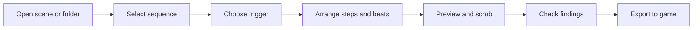
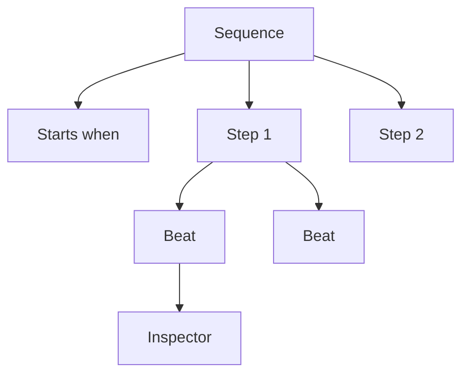
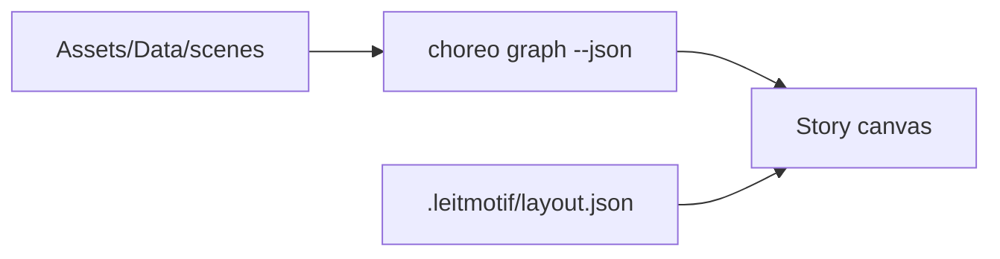
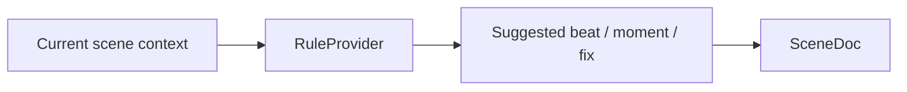
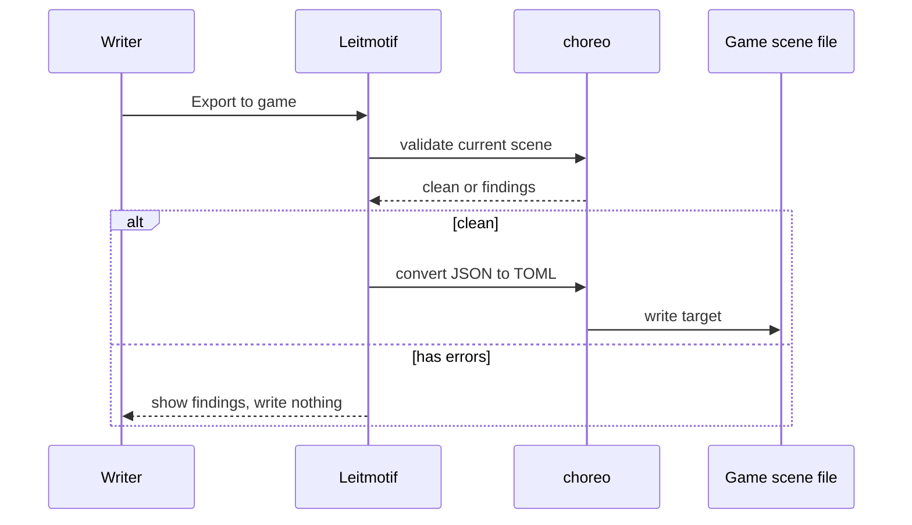

This page is for the person sitting in front of Leitmotif and trying to author a scene.

Leitmotif is not a separate runtime. It is an editor for choreography data the game already knows how to load.

## The Basic Loop

In practice:

1. Open a scene file or a folder of scene files.
2. Select a sequence in the left pane.
3. Decide what starts it in the trigger panel.
4. Add, remove, move, or edit beats on the timeline.
5. Use the stage to place world-point actions when possible.
6. Run Check.
7. Export only once the scene validates.

## The Screen

<figure class="wide-figure">
  
  <figcaption>The core layout is stable: scene structure on the left, preview and timeline in the center, selected beat details on the right.</figcaption>
</figure>

| Area | What it is for |
| --- | --- |
| Header | New, open, save, undo, redo, story mode, and export. |
| Sequences | The named choreography units in the current scene. |
| Stage | A preview shell and placement surface for world-point beats. |
| Transport | Play, pause, scrub, and rebuild the preview. |
| Timeline | Ordered steps. Beats inside one step run together. |
| Trigger panel | The condition that starts the selected sequence. |
| Inspector | The selected beat's actor, verb, and relevant fields. |
| Validation ribbon | Check the scene and apply safe fix suggestions. |

## Scene Mode

Scene mode is the normal beat-editing workspace.

A sequence is the thing the game starts. A step is a moment in time. Beats inside the same step happen in parallel.

Good first edits:

- change a trigger from `Always` to `After N seconds`
- add a `say` beat after a `walk_in`
- drag a beat to another step
- select a `walk_to` beat and click the stage to set `x` and `y`
- press `?` to learn the shortcuts

## Story Mode

Story mode is for opening a folder of scenes and seeing how scene files chain.

The graph comes from the game's own `choreo graph --json` output. Node positions are stored in a `.leitmotif/layout.json` sidecar beside the scene folder. That sidecar is editor layout data, not gameplay data.

Use story mode when you care about whole-story flow. Use scene mode when you care about one sequence's beats.

## Adding Beats

Use the `+ beat` control on a step. The picker shows:

- the most likely suggested next beat
- the broader verb list from `src/vocab.ts`

<figure class="wide-figure">
  
  <figcaption>The picker is intentionally biased toward common authoring moves without hiding the full vocabulary.</figcaption>
</figure>

After a beat is added, select it and edit fields in the inspector. The form shows only fields relevant to the selected verb.

## Placing Beats On The Stage

Some verbs carry a world point:

- `walk_to`
- `walk_in`
- `teleport_to`
- `spawn_fx`
- `spawn_enemy`

When one of these beats is selected, click the stage to set the position. This is the normal path for coordinate fields. Typing numbers is still possible, but it should not be the primary authoring experience.

## Using Suggestions

Leitmotif's current suggestions are deterministic and offline. They do not call an external service.

Suggestions are useful for:

- "what should happen after this beat?"
- inserting a small ready-made moment
- fixing a known validation finding
- snapping a placed point near an actor

Treat a suggestion as a draft, not as intent. The writer still chooses.

## Checking And Exporting

Use Check while authoring. Check asks `choreo validate` for findings. If the finding is narrow and safe, the validation ribbon can offer a Fix button.

Export is stricter:

The editor should not write invalid content to the game. If export refuses, fix the finding or decide whether the engine contract needs to change.

## Keyboard Shortcuts

<figure class="wide-figure">
  
  <figcaption>The shortcut overlay is generated from the same key binding table as the actual shortcuts.</figcaption>
</figure>

High-frequency shortcuts:

| Key | Action |
| --- | --- |
| `Space` | Play or pause preview. |
| `A` | Add a beat on the selected step. |
| `Enter` | Accept the top suggested beat. |
| `J` / `K` | Move beat selection. |
| `Shift+J` / `Shift+K` | Move step selection. |
| `X` | Delete selected beat. |
| `F` | Apply first available fix. |
| `Shift+F` | Apply all available fixes. |
| `Ctrl+Z` / `Ctrl+Y` | Undo / redo. |
| `?` | Toggle shortcut help. |

## Web Shell Limits

`npm run dev` is excellent for UI work, screenshots, and tests. It does not have native Tauri access.

In web-only mode:

- native file dialogs are unavailable
- bridge commands return friendly fallback errors
- live preview from `choreo` is unavailable
- dev-only `window.__lmLoad(json)` can load sample data for visual checks

For real file open, save, preview, graph, validate, and export work, run the Tauri app with `CHOREO_BIN` set.
