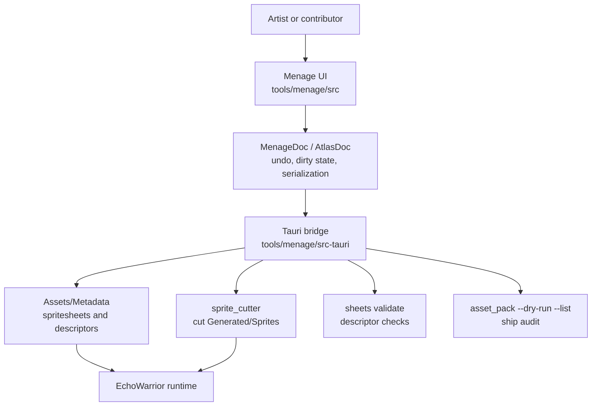

<figure class="wide-figure">
  
  <figcaption>Menage is the asset-management surface for sprite sheets and atlas descriptors: source art on the stage, cutting instructions in the inspector, and validation feedback close to the edit.</figcaption>
</figure>

Menage is EchoWarrior's asset housekeeper. It is a Tauri desktop app with a Vite and TypeScript frontend, built for the moment when a contributor has a PNG, knows what it should become, and needs to turn that intent into game-readable metadata without guessing at pixel coordinates.

It does not own gameplay. It does not rewrite runtime code. Its job is to make the asset pipeline visible and harder to break.

## What It Owns

The important boundary is simple:

| Area | Menage responsibility |
| --- | --- |
| `Assets/Metadata/spritesheets.toml` | Edit sprite-sheet and tileset cutting instructions. |
| `Assets/Metadata/*_spritesheet.toml` | Edit atlas/grid descriptors for named sprites and descriptor-local animations. |
| `Generated/Sprites/` | Ask `sprite_cutter` to cut output; Menage does not cut frames itself. |
| `data.pak` discoverability | Ask `asset_pack --dry-run --list` which source assets ship. |
| Rust runtime behavior | Out of scope. The game consumes the metadata after the tool saves it. |

## First Mental Model

Think of Menage as three panes and one gate:

| Surface | What to look for |
| --- | --- |
| Library | Registered sheets, tilesets, atlas descriptors, and unregistered PNGs under `Assets/Graphics/sprites`. |
| Stage | The source image with its grid, animation bands, selected cells, or atlas sprite rectangles. |
| Inspector | The editable TOML facts: ids, paths, frame sizes, grid counts, animation rows, descriptor sprites, tags, and frame lists. |
| Validation ribbon | Live lint first; the game validator when you press `Check`. Save refuses error-level findings. |

## Contributor Entry Points

Start here if you are new:

1. [Getting Started](getting-started/) to run the app in web-only or Tauri mode.
2. [Usage](usage/) to register a sheet, inspect a descriptor, validate, save, cut, and audit.
3. [Asset Pipeline](asset-pipeline/) to understand the contract with `sprite_cutter`, `sheets`, and `asset_pack`.
4. [Screenshots](screenshots/) to connect the visual surface to the code.
5. [Contributor Slices](contributor-slices/) for small safe improvements.

## Rule Of Thumb

When you change Menage, preserve the game's authority:

- mutate tool state through `MenageDoc` or `AtlasDoc`
- keep file and CLI access behind `src/bridge.ts` and `src-tauri/src/main.rs`
- treat client lint as advisory
- gate real saves through game-side validation when running in Tauri
- keep generated sprite output and asset-pack inventory as consequences, not hand-authored truth
