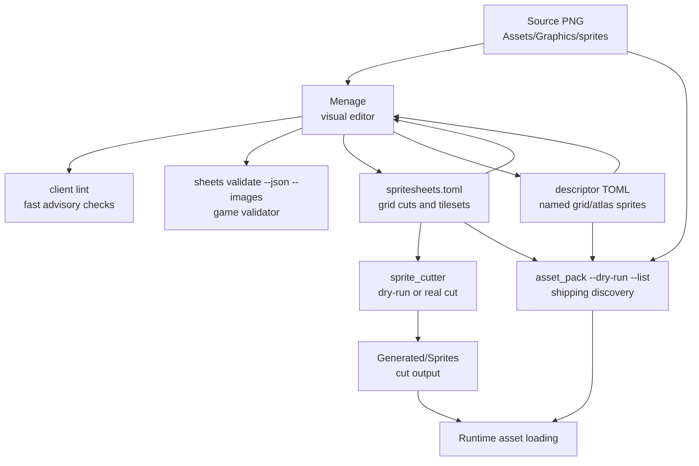
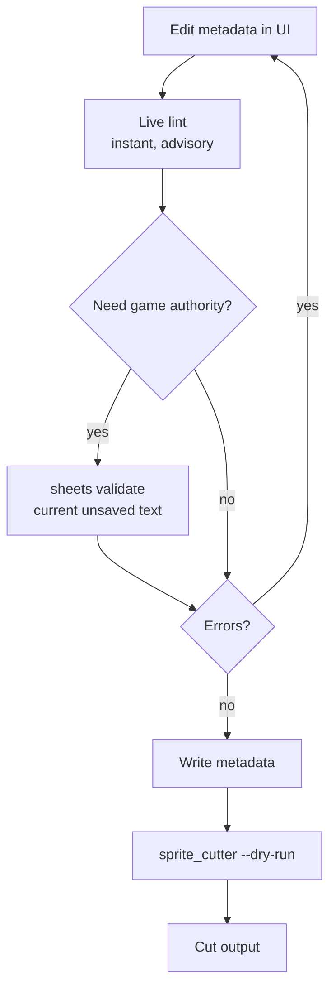
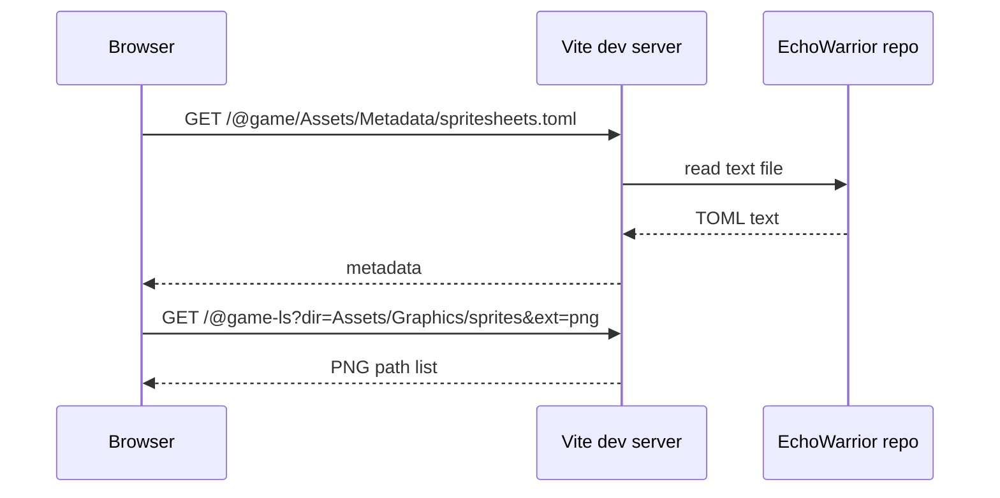

Menage exists because EchoWarrior has more than one asset truth. Source PNGs, metadata, generated sprites, and release packs all answer different questions.

## The Pipeline

The safest way to read this graph:

- `Assets/Graphics/sprites` is source art.
- `Assets/Metadata` is authored instruction data.
- `Generated/Sprites` is derived output.
- `data.pak` discovery is checked by `asset_pack`.
- Menage should make those relationships visible, not invent a parallel format.

## Files Menage Edits

| File family | Model in Menage | Notes |
| --- | --- | --- |
| `Assets/Metadata/spritesheets.toml` | `MenageDoc` | Main cut-instruction document. |
| `Assets/Metadata/*_spritesheet.toml` | `AtlasDoc` | Descriptor documents with `type = "grid"` or `type = "atlas"`. |

`MenageDoc` and `AtlasDoc` both use the same history pattern: changes go through `apply()`, undo/redo snapshots are bounded, and successful writes mark the document clean.

## The Validation Ladder

Live lint is fast and local. It catches empty ids, duplicate names, impossible grids, missing output directories, row-wrapping animations, and known image-size mismatches.

The game-side validators remain the final authority:

| Tool | Used for |
| --- | --- |
| `sheets validate --json --images` | Save gate for descriptors and the `Check` button. |
| `sprite_cutter --dry-run` | Save gate for `spritesheets.toml` in Tauri mode and the dry-run report. |
| `asset_pack --dry-run --list` | Audit source assets against what would ship in `data.pak`. |

## Why Web Mode Is Read-Only

In web-only mode, the Vite dev server serves files from the game repo:

That is enough to browse and preview. It is not enough to write files or spawn Rust binaries, so save, cut, check, and audit actions need the Tauri shell.

## Graceful Degradation

Menage follows the same family rule as the game:

| Missing piece | Behavior |
| --- | --- |
| Image not loaded yet | Stage still shows a grid preview and the path remains editable. |
| Web-only mode | Read-only browsing works; native actions explain that Tauri is required. |
| Missing `asset_pack` | Audit still reports registered/unregistered PNGs, but ship status is unknown. |
| Missing `sheets` | Live lint remains available; game-validator findings are unavailable. |
| Missing `sprite_cutter` | Metadata editing works; dry-run and cut actions explain the missing binary. |

This makes Menage useful during partial setup while still keeping release-significant writes behind the real game tools.
