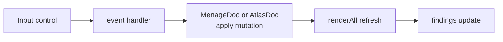
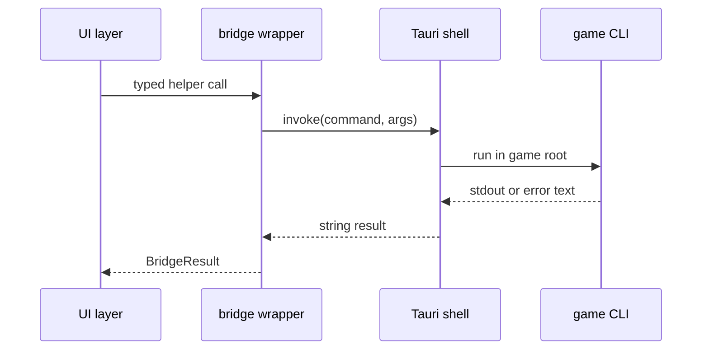

Menage is a good tool for small, safe improvements because most behavior is already split by responsibility. Pick one seam, keep the game CLIs authoritative, and verify the pure TypeScript pieces before touching the Tauri shell.

## Slice 1: Improve A Live Lint

Good first change:

1. Read `tools/menage/src/instructions.ts` or `tools/menage/src/atlasfile.ts`.
2. Add one advisory finding.
3. Add or update the matching Vitest case.
4. Run `npm test`.

Use this for checks that are cheap and local, such as duplicate ids, impossible frame counts, or descriptor animation frames that name missing sprites.

Do not duplicate a complex game rule by hand if the `sheets` CLI already owns it. In that case, improve the UI around validator output instead.

## Slice 2: Add A Safer Inspector Field

The inspector lives in `tools/menage/src/form.ts`.

Keep the pattern:



Avoid direct mutation from UI code. The document classes own dirty state and undo/redo history.

## Slice 3: Improve The Stage

The source-image and descriptor overlays live in `tools/menage/src/stage.ts`.

Safe examples:

- clearer selected-cell outline
- better label placement for narrow cells
- a hover affordance that does not resize the canvas
- a zoom-step tweak that preserves pixel-art nearest-neighbor rendering

Watch for layout churn. The canvas size is derived from image/grid facts and zoom, so hover states should redraw inside the same canvas dimensions.

## Slice 4: Extend The Bridge

Only add a bridge command when the game has a stable CLI or file contract for it.



When adding one:

- add a typed wrapper in `src/bridge.ts`
- add one Tauri command in `src-tauri/src/main.rs`
- pass the game root as working directory
- return CLI stdout/stderr verbatim enough for the report panel
- test the pure parsing part separately when possible

## Slice 5: Improve The Audit

The audit logic is pure in `tools/menage/src/inventory.ts`.

It currently cross-references:

- images registered by instructions
- PNGs on disk under `Assets/Graphics/sprites`
- paths reported by `asset_pack --dry-run --list`

Good improvements include clearer grouping, better path normalization, or a more helpful summary when `asset_pack` is unavailable.

## Verification Menu

Use the smallest check that proves the slice:

```powershell
cd tools/menage
npm test
npm run build
cd src-tauri
cargo test
```

For pipeline-facing changes, also run from the game repo root:

```powershell
cargo run --bin sprite_cutter -- --all --dry-run
cargo run --bin asset_pack -- --dry-run --list
```
