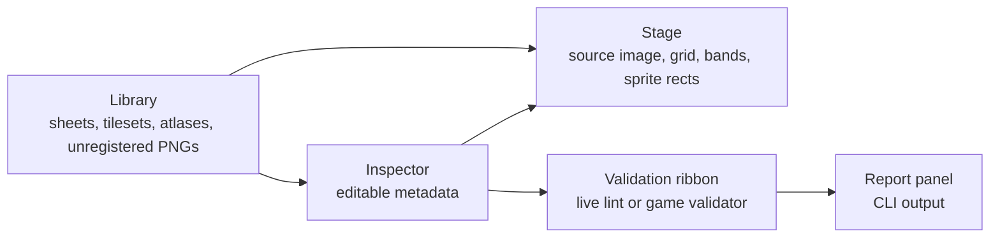

This page is the contributor loop: start with a PNG, describe it, validate the description, then let the game tools produce or audit the result.

## The Main Screen

Use the Library first. It tells you whether the asset already has instructions, whether it is a tileset, sheet, or descriptor, and whether a PNG under `Assets/Graphics/sprites` is currently unregistered.

## Register A Simple Sheet

Use this when a PNG is a regular grid of frames, such as a character sheet or an effect sheet.

1. Put the PNG under `Assets/Graphics/sprites/...`.
2. Click `scan` in the Unregistered group.
3. Find the PNG and click `+ sheet`.
4. Set the sheet id, path, kind, frame width, frame height, columns, rows, and output directory.
5. Add animations. Each animation uses one row, a start column, frame count, fps, and optional horizontal flip.
6. Press `Check`.
7. Press `Save to game`.
8. Run `Dry-run`, then `Cut sheet` when the saved metadata is correct.

The live lint catches obvious mistakes while typing. The important save gate is still the game-side validator and cutter dry-run.

## Edit An Atlas Descriptor

Use this when the image is described by named sprites rather than one global cut output.

1. Select an entry in the `Atlases` group.
2. Confirm the descriptor kind: `grid` uses cell indexes, `atlas` uses explicit rectangles.
3. Click a sprite rect on the Stage to select it.
4. Rename the sprite, adjust placement fields, pivots, trimming, or tags in the inspector.
5. Open or add a descriptor animation.
6. With an animation open, click sprite cells on the Stage to append frame names.
7. Press `Check`.
8. Press `Save to game`.

Descriptor saves are gated by `sheets validate --json --images` in Tauri mode. The tool intentionally avoids silently dropping descriptor fields the game reads.

## Preview The End Product

For sheet entries, switch from `Stage` to `Atlas - end product`.

<figure class="wide-figure">
  
  <figcaption>The end-product tab renders the same cropped frames the cutter will write, grouped by animation and output directory.</figcaption>
</figure>

This view is useful before cutting because it shows:

- whether the right cells are included
- whether `flip_x` is producing the expected mirrored frames
- what output directory and filename pattern the cutter will use
- whether an animation row or frame count is off by one

## Save, Cut, Audit

The buttons are deliberately separate:

| Button | Meaning |
| --- | --- |
| `Save to game` | Validate and write the active metadata document. |
| `Dry-run` | Ask `sprite_cutter --dry-run` what it would cut from current sheet instructions. |
| `Cut sheet` | Cut only the selected saved sheet into `Generated/Sprites/`. |
| `Cut all` | Cut every saved sheet instruction. |
| `Audit` | Cross-reference instructions, PNGs on disk, and `asset_pack --dry-run --list`. |
| `Check` | Run `sheets validate --json --images` on the current edit state. |

`Cut sheet` and `Cut all` are blocked while `spritesheets.toml` has unsaved changes. This is intentional: real cuts read the saved file, so the UI refuses to let you cut a stale version by accident.

## Common Mistakes

| Symptom | Likely cause |
| --- | --- |
| Save is refused | There is an error-level live lint or game validator finding. |
| Cut buttons complain about unsaved changes | Save first; the cutter reads saved metadata. |
| `Check` says the validator is unavailable | Build `sheets` and run inside Tauri with `MENAGE_SHEETS_BIN` set or on `PATH`. |
| `Dry-run` says it needs the desktop shell | You are in web-only Vite mode. Use `npm run tauri:dev`. |
| Audit says pack status is unknown | `asset_pack` is missing or unreachable. |
| A PNG stays unregistered | It may be referenced by an atlas descriptor rather than `spritesheets.toml`; either counts as registered. |
