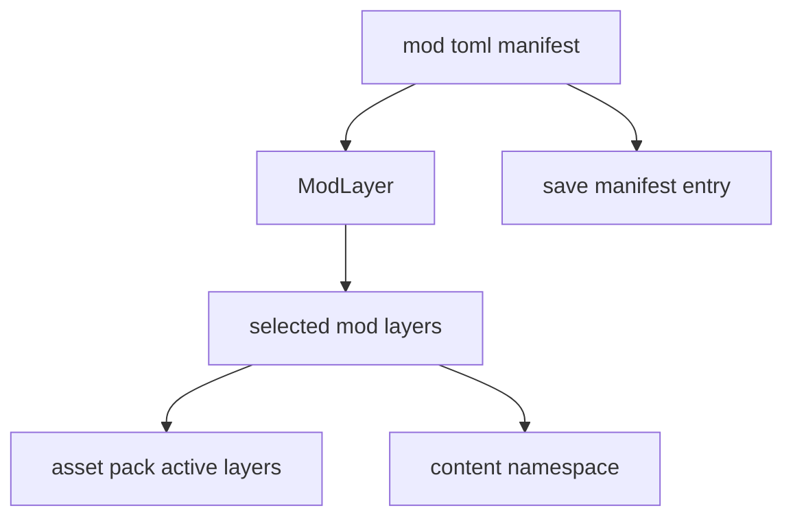
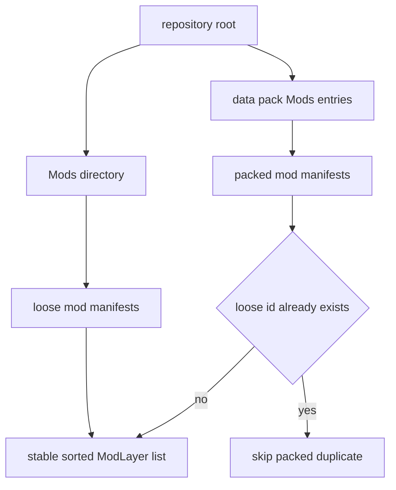
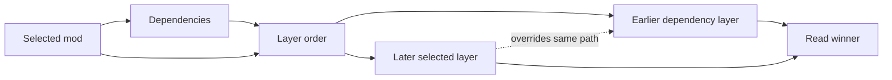
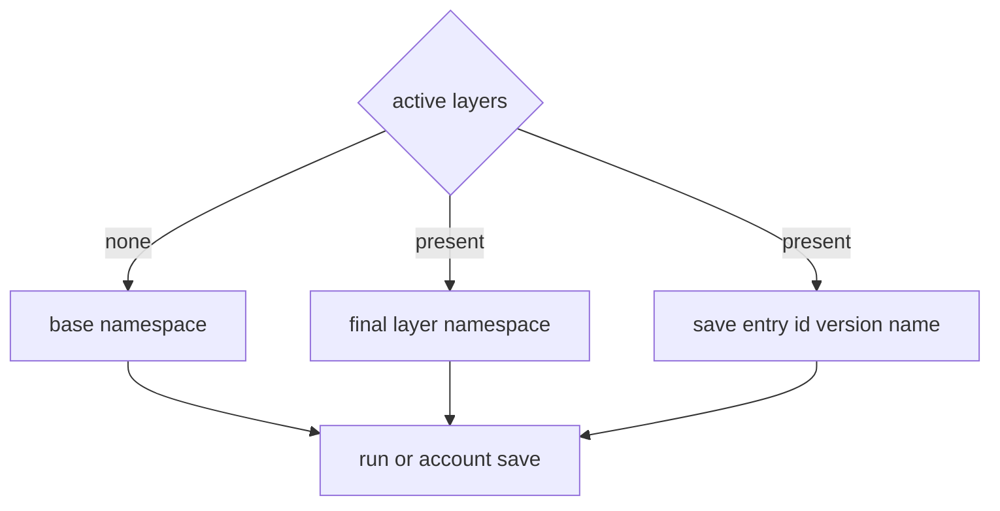

## `src/modding.rs`

`src/modding.rs` is the main-code layer for selectable mod packs.



It defines:

- `MODS_DIR = "Mods"`
- `MOD_MANIFEST_FILE = "mod.toml"`
- `ModManifest`
- `ModLayer`

## Manifest Shape

`ModManifest` is serialized and deserialized from TOML:

```toml
id = "example_pack"
name = "Example Pack"
version = "0.1.0"
namespace = "example"
dependencies = []
description = "Optional human-readable description."
disable_studio_intro = false
```

If `name` is empty, `display_name()` falls back to `id`. If `namespace` is empty, `namespace()` also falls back to `id`.

`disable_studio_intro` may suppress the canonical studio intro, but mods cannot replace identity media.

## Discovery

`discover_mods(root)` scans:

```text
Mods/<mod_id>/mod.toml
```

It also checks vanilla `data.pak` for packed mod manifests. Loose manifests win when a loose mod id already exists.

Discovered mods are sorted by id for stable presentation.



## Dependency Ordering

`selected_mod_layers(root, selected_id)` returns the dependency-ordered layers for the selected mod. Dependencies are collected before the selected mod, so later layers can override earlier layers.

Cycles are ignored safely by the visited/visiting sets rather than crashing.



## Save Namespace

`content_namespace(layers)` uses the namespace of the final selected layer, or `base` when no mod layer is active.

The manifest's `save_entry()` converts the active mod into the compact save metadata stored with run/account data.



## When To Edit This File

Edit `src/modding.rs` when the manifest format or dependency/layering rules change.

Do not put content-specific behavior here. Content behavior should live in data files, loaders, Lua hooks, choreography, or runtime application code.
