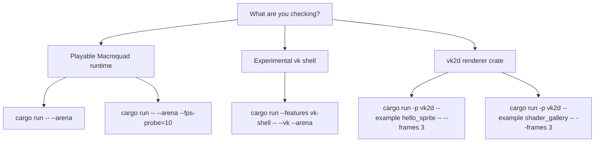
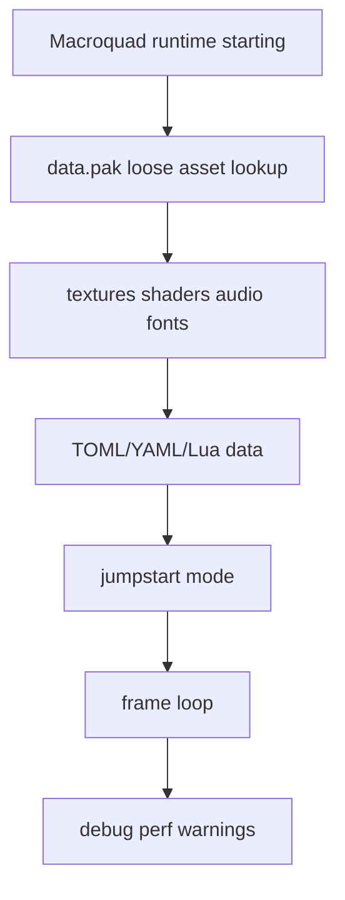
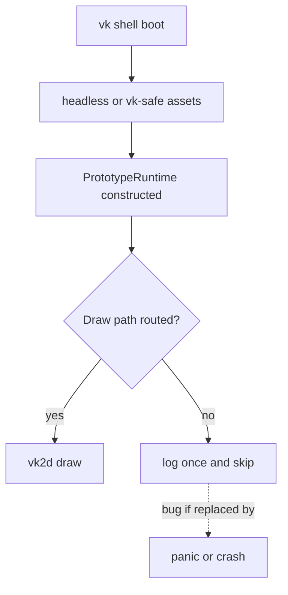
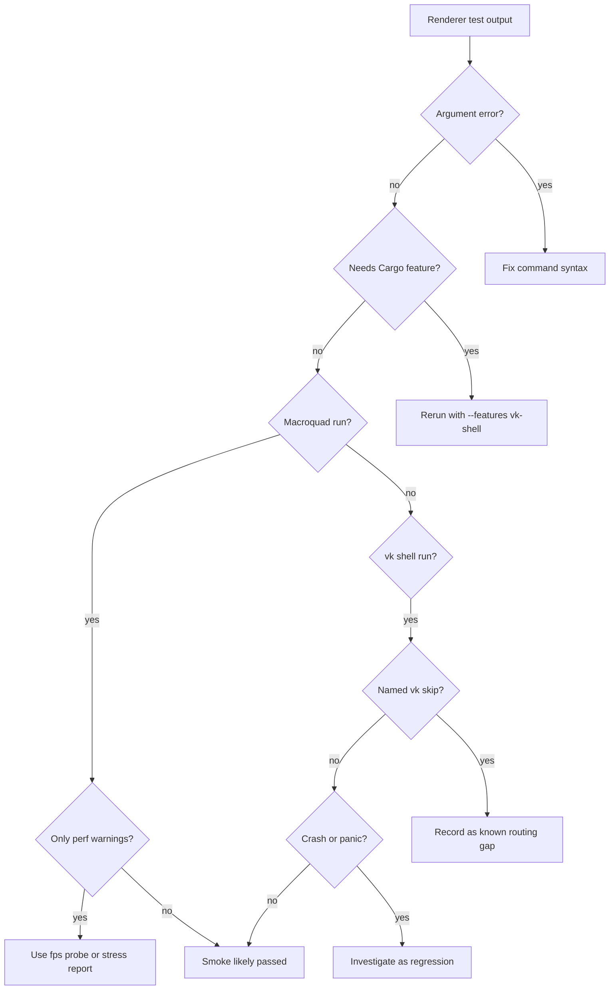

Renderer work now has three different smoke surfaces. This page helps you pick the right one and interpret the output without chasing the wrong problem.

## The Three Doors



| Surface | Use it when | What success means |
| --- | --- | --- |
| Macroquad runtime | You changed normal gameplay, UI, audio, assets, or `Renderer2d` routing that still presents through Macroquad. | The playable game starts, enters the requested mode, and shows no new runtime errors. |
| vk shell | You changed `--vk`, `renderer_vk.rs`, `vk_assets.rs`, backend guards, or target/view routing intended for the live shell. | The shell boots far enough to show first-light output and logs explicit gaps instead of panicking. |
| `vk2d` examples | You changed the reusable renderer crate or its public drawing/material API. | The renderer crate can create a window/frame, draw examples, and exit automatically. |

## Command Matrix

| Command | Expected path |
| --- | --- |
| `cargo run` | Macroquad title screen. |
| `cargo run -- --arena` | Macroquad runtime, Arena jumpstart, studio intro skipped. |
| `cargo run -- --arena --fps-probe=10` | Macroquad Arena with a timed `[fps] ...` stderr summary, then exit. |
| `cargo run -- --vk` | Default build rejects the flag with `this build has no vk shell`. That is expected unless `vk-shell` is enabled. |
| `cargo run --features vk-shell -- --vk --arena` | Experimental winit/vk2d shell, Arena jumpstart. |
| `cargo run --bin wgpu_probe -- --frames 3` | Older isolated Vulkan-facing probe path, separate from the current `--vk` runtime shell. |
| `cargo run -p vk2d --example shader_gallery -- --frames 3` | Renderer crate self-check, independent of EchoWarrior runtime state. |

There is no `--features-check` launch flag. If you see:

```text
error: unknown argument: --features-check
```

the executable is working as designed: `src/runtime/launch.rs` rejected an unknown game argument before opening a window. Cargo features belong before `--`, for example:

```powershell
cargo run --features vk-shell -- --vk --arena
```

## Expected Macroquad Output

A normal Macroquad Arena run is loud in debug builds. These are not automatically failures:

```text
[asset-pack] loaded ... data.pak
[data] loaded ... definitions
[shader] loaded 'spark'
[audio] preloaded SFX ...
WARN echo_warrior::perf: debug performance scope exceeded budget ...
```

Read the shape:



Perf warnings in debug builds mean a scoped section exceeded its local diagnostic budget. They are useful leads, not proof that a renderer migration broke correctness. For a comparable number, run `--fps-probe` or the stress ladder.

## Expected vk Shell Output

The vk shell is intentionally partial. A useful first-light run may still print:

```text
[vk] audio silent — macroquad audio not available under the vk shell
[vk] scene background clear not yet routed — shell clear color shows
[vk] terrain ground not yet routed — skipped
[vk] weather overlay not yet routed — skipped
[vk] arena egui panel not yet routed — skipped
[vk] material-on-geometry not yet supported: MaterialId(...)
```

Those lines are the current fallback contract. They tell you a Macroquad-only or not-yet-routed subsystem was skipped gracefully instead of calling a raw Macroquad global under a winit/vk2d shell.



Treat a new skip line as a TODO, not a regression, when it names an intentionally missing route. Treat a panic, black screen after previously visible content, or missing log around a skipped raw Macroquad call as a regression.

## What The Common Lines Mean

| Output | Meaning | Usual next step |
| --- | --- | --- |
| `this build has no vk shell` | `--vk` was passed to a default build. | Re-run with `cargo run --features vk-shell -- --vk ...`. |
| `unknown argument: --features-check` | A non-existent game flag was passed after Cargo's `--`. | Move Cargo feature flags before `--`, or use `--help` for game flags. |
| `audio silent` | The vk shell does not use Macroquad audio. | Ignore unless your task is vk-shell audio support. |
| `terrain ground not yet routed` | Terrain chunks still draw through raw Macroquad in the shipped path. | Route terrain textures through `Renderer2d` only in a deliberate slice. |
| `weather overlay not yet routed` | Weather overlay still has Macroquad-specific draw calls. | Use this as a candidate follow-up, not an immediate failure. |
| `material-on-geometry not yet supported` | A vk draw path received a material it cannot yet apply to that primitive. | Add backend material support or degrade visibly and documented. |
| `debug performance scope exceeded budget` | Debug timing scope exceeded its local warning threshold. | Compare with `--fps-probe` or benchmark output before optimizing. |

## Decision Tree



## Good Renderer Smoke Notes

When reporting a renderer check, include:

- exact command
- whether it was Macroquad, `--vk`, `wgpu_probe`, or `vk2d`
- mode, such as title, Arena, new run, or stress
- the first unexpected stderr line
- whether skip logs are existing known gaps or new ones
- screenshots when the visual result matters

Useful examples:

```powershell
cargo run -- --arena --fps-probe=10
cargo run --features vk-shell -- --vk --arena
cargo run -p vk2d --example shader_gallery -- --frames 3
```

For the architecture behind these checks, read [Vulkan Renderer Path](architecture/vulkan-renderer-path/), [vk2d Runtime Usage](architecture/vk2d-runtime-usage/), and [Renderer Submodule Workflow](renderer-submodule-workflow/).
