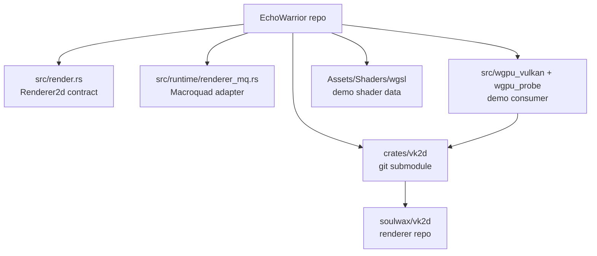
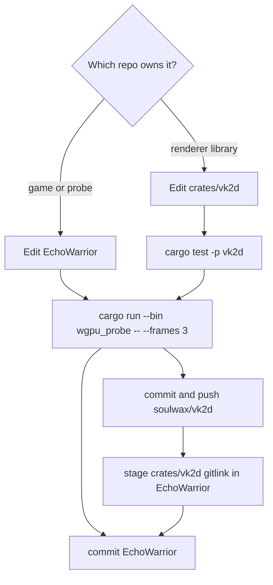

`vk2d` is its own renderer project at [soulwax/vk2d](https://github.com/soulwax/vk2d). EchoWarrior consumes it through the `crates/vk2d` submodule.

This matters because renderer changes have two repositories in play:

- `EchoWarrior`: game code, `Renderer2d`, Macroquad adapter, probe consumer, assets, wiki
- `soulwax/vk2d`: reusable renderer library, public API, wgpu/Vulkan internals, examples, renderer tests

## First Setup

From a fresh EchoWarrior clone:

```powershell
git submodule update --init crates/vk2d
cargo test -p vk2d
cargo run --bin wgpu_probe -- --frames 3
```

If `crates/vk2d` is missing or empty, the workspace cannot build because the root package depends on the local renderer submodule.

## Ownership Map



Game-specific paths such as `Assets/Graphics/...` belong in EchoWarrior's probe or runtime code. They do not belong in `soulwax/vk2d`.

## Which Repo Do I Edit?

| Change | Edit where | Commit order |
| --- | --- | --- |
| Move a game draw site through `Renderer2d` | EchoWarrior | commit EchoWarrior only |
| Add a neutral draw verb to `src/render.rs` | EchoWarrior first, then backend follow-up | commit EchoWarrior with the contract and adapter changes together |
| Fix `MacroquadRenderer` behavior | EchoWarrior | commit EchoWarrior only |
| Improve `wgpu_probe` demo assets, uniforms, or overlay | EchoWarrior | commit EchoWarrior only |
| Change `vk2d` public API or rendering internals | `crates/vk2d` / `soulwax/vk2d` | commit and push `vk2d`, then deliberately bump the EchoWarrior submodule pointer |
| Update `vk2d` examples or renderer tests | `crates/vk2d` / `soulwax/vk2d` | commit and push `vk2d`, then bump the parent pointer if EchoWarrior should consume it |

## Renderer Library Requirements

For the renderer module map and frame/material/target flow, read [vk2d Renderer Internals](architecture/vk2d-renderer-internals/).

These are the current `vk2d` requirements that EchoWarrior docs and code should preserve:

| Requirement | Meaning for contributors |
| --- | --- |
| immediate-mode frame API | App code uses `Context::begin_frame`, draws on `Frame`, then presents. |
| app-supplied bytes | `vk2d` receives decoded RGBA and TTF bytes; it does not know EchoWarrior file paths. |
| shaders are data | A material is WGSL text plus a `MaterialDesc` uniform declaration, not a Rust module per shader. |
| startup shader diagnostics | WGSL is parsed/validated through naga when the material loads. |
| no public panics | Setup and resource loading return `Result`; per-frame draw calls skip bad handles. |
| no backend leaks | Public API uses `Color`, `Point`, `Rect2`, handles, and feature-gated integrations. |
| fixed logical scene | The renderer draws to a logical target and nearest-upscales to the window. |
| optional integrations | `egui` and `winit-input` stay behind feature flags. |

## Safe Commit Flow



Do not stage a submodule pointer change as a side effect of unrelated game work. A pointer bump means "EchoWarrior now consumes this exact renderer commit."

## Verification Matrix

| Slice | Minimum useful checks |
| --- | --- |
| EchoWarrior draw-site migration | `cargo check`, then `cargo run` when behavior changed |
| `wgpu_probe` demo change | `cargo run --bin wgpu_probe -- --frames 3` |
| `vk2d` renderer library change | `cargo test -p vk2d`, `cargo run -p vk2d --example hello_sprite -- --frames 3`, `cargo run -p vk2d --example shader_gallery -- --frames 3` |
| Shader data used by the probe | `cargo run --bin wgpu_probe -- --frames 3` and check shader fallback messages |
| Wiki-only renderer docs | `npm run wiki:audit`, `npm run build` |

## Clean Status Checks

Before committing, inspect both repositories:

```powershell
git status --short
git -C crates/vk2d status --short
git submodule status crates/vk2d
```

If `git status` shows `m crates/vk2d`, the parent sees a different renderer commit than the one currently recorded. Commit that pointer only when the renderer commit was intentionally updated and already pushed to `soulwax/vk2d`.
