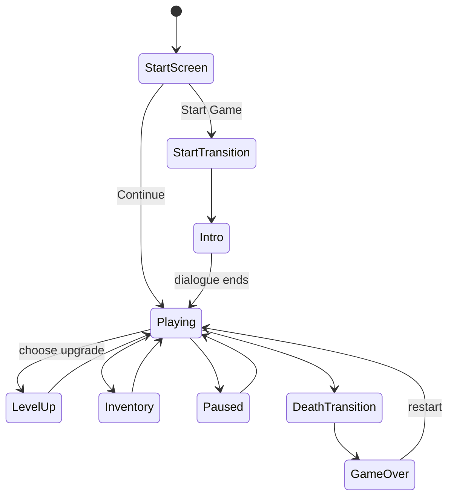
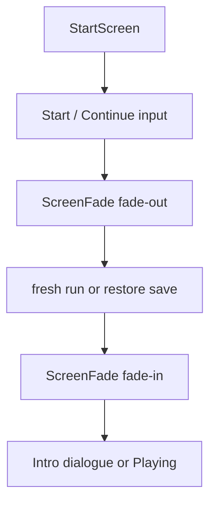

`src/runtime/` is the playable Macroquad prototype. It is binary-private: `src/main.rs` declares `mod runtime`, while `src/lib.rs` exposes the renderer-agnostic crate modules used by tests and tools.

## Boundary

```mermaid
flowchart LR
    main[src/main.rs]
    config[src/runtime/config.rs]
    run[src/runtime/mod.rs run()]
    assets[src/runtime/assets.rs]
    pure[src/game, src/data, src/ui, src/save]
    mq[Macroquad window, input, audio, draw]

    main --> config
    main --> run
    run --> assets
    run --> pure
    run --> mq
```

The runtime is allowed to import Macroquad. Shared gameplay/data modules should not.

## Window Configuration

`src/runtime/config.rs` defines:

| Constant/function | Current role |
| --- | --- |
| `VIEW_WIDTH` / `VIEW_HEIGHT` | Fixed 1600x900 presentation target. |
| `WORLD_SIZE` | 3840x2160 playable world size. |
| `CHARACTER_FRAME` | 48x48 base sprite frame size. |
| `window_conf()` | Macroquad `Conf` passed through `src/main.rs`. |
| `resolve_sample_count()` | Floors modded MSAA samples to `1, 2, 4, 8, 16`. |

`window_conf()` reads `Assets/Data/settings.toml` directly because Macroquad needs window settings before `runtime::run()` can build the full runtime. MSAA is therefore a restart-required setting.

## Runtime Startup

At a high level, `runtime::run()` does this:

```mermaid
sequenceDiagram
    participant Main as src/main.rs
    participant Run as runtime::run()
    participant Data as Assets/Data loaders
    participant Loader as AssetLoader
    participant Loop as frame loop

    Main->>Run: await runtime::run()
    Run->>Data: load settings, characters, music, world data
    Run->>Loader: phase-step RuntimeAssets
    Loader-->>Run: terrain, characters, effects, audio, fonts
    Run->>Loop: build PrototypeRuntime and tick/draw frames
```

Startup failures return `Err(String)`. `src/main.rs` prints the error and calls `runtime::show_error()` so failures are visible in the game window.

## Runtime Modes

The shared `AppState` enum is intentionally small. The live runtime has its own richer mode model inside `src/runtime/mod.rs`.



Mode changes are not cosmetic. They decide whether simulation advances, what owns input focus, what UI overlays draw, and how audio fades.

## Start Screen Flow

The current start screen uses worst-weather atmosphere and delayed gameplay handoff:



Fresh starts switch music to `intro_music_track_id`; continuing switches to `gameplay_music_track_id`.

## Contributor Rules

- Keep Macroquad-specific code in `src/runtime/`.
- Add pure calculations to `src/game`, `src/data`, `src/ui`, or another library module when possible.
- When adding a runtime mode, check update, draw, input, audio, save, and debug overlay behavior.
- When adding a start-screen or scene transition, use the existing `ScreenFade` path instead of inventing a second fade system.
- When adding window-level settings, remember `window_conf()` runs before normal runtime initialization.
