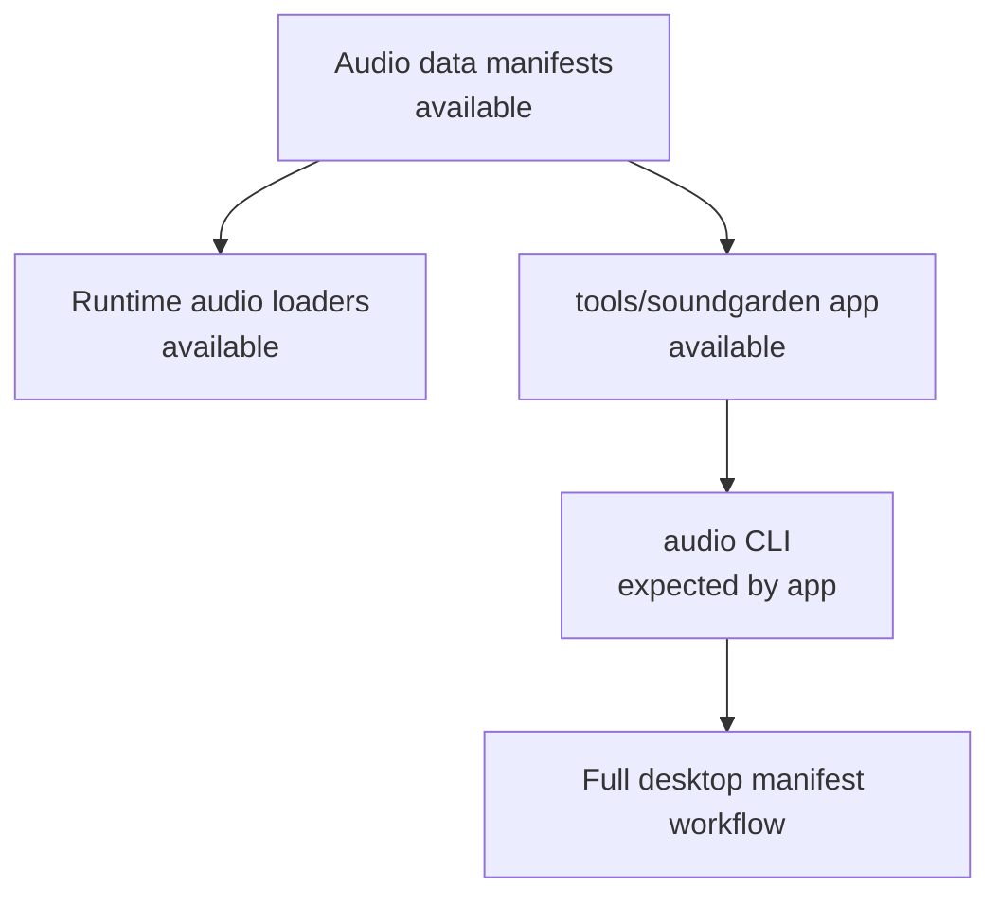
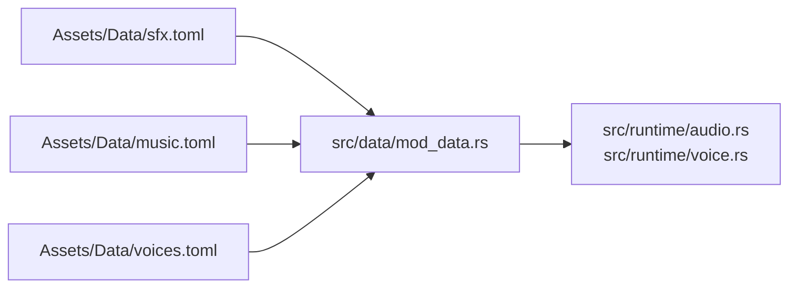

<figure class="wide-figure">
  
  <figcaption>Soundgarden is the planned audio studio for EchoWarrior: a tool for tending SFX, music, and voice manifests that the game runtime already consumes.</figcaption>
</figure>

Soundgarden is the third major contributor topic in this wiki, beside the game runtime and Leitmotif.

Its goal is clear: make audio manifests easier to browse, validate, edit, and export without hardcoding sound paths in Rust.

## Current Availability

What is available in this checkout:

| Area | Status | Notes |
| --- | --- | --- |
| Audio manifests | Available | `Assets/Data/sfx.toml`, `music.toml`, and `voices.toml` exist and are loaded by the game. |
| Runtime audio | Available | `src/runtime/audio.rs` and `src/runtime/voice.rs` consume the manifest data. |
| Manifest Rust types | Available | `SfxDef`, `TrackDef`, `VoiceDef`, and manifest wrappers live in `src/data/mod_data.rs`. |
| Soundgarden app | Available | `tools/soundgarden` contains the Tauri/Vite app, document model, bridge wrappers, and tests. |
| `audio` CLI | Not present in current main checkout | Soundgarden expects `audio validate`, `convert`, `schema`, `assets`, and `scan`, but `src/bin/audio.rs` is not currently present. |
| Full desktop workflow | Blocked until CLI exists | Tauri bridge commands need `AUDIO_BIN` or an `audio` binary on `PATH`. |
| Submodule mapping | Needs attention | `tools/soundgarden` exists locally, but `git submodule status` reports no `.gitmodules` mapping for it. |

So the practical reading is: the audio data and the studio shell are real, but the full app-to-game contract is only usable once the missing CLI and submodule mapping are restored.

## Why It Exists

Audio content is already data-driven:

Soundgarden is meant to sit on top of that data, not replace it.

A contributor should use it as an authoring surface for manifests. The exported result should still be normal TOML that ships through the same asset and mod packaging paths as the rest of the game.

## Pages In This Chapter

Start here:

1. [Available Now](soundgarden/available-now/) for the exact local capabilities and blockers.
2. [Manifest Studio](soundgarden/manifest-studio/) for how the current app is shaped.
3. [Audio Manifests](soundgarden/audio-manifests/) for the `sfx`, `music`, and `voices` data model.
4. [Architecture](soundgarden/architecture/) for the app, bridge, CLI, and runtime boundaries.
5. [Moddability](soundgarden/moddability/) for how audio content should stay mod-friendly.

## Rule Of Thumb

When contributing to Soundgarden:

- keep manifests as normal TOML
- keep edit state inside `AudioDoc`
- keep native and CLI calls behind the bridge
- do not hardcode runtime audio paths in the editor
- treat the game loaders and manifest structs as the source of truth
- repair or implement `audio` before claiming the desktop export flow is complete

