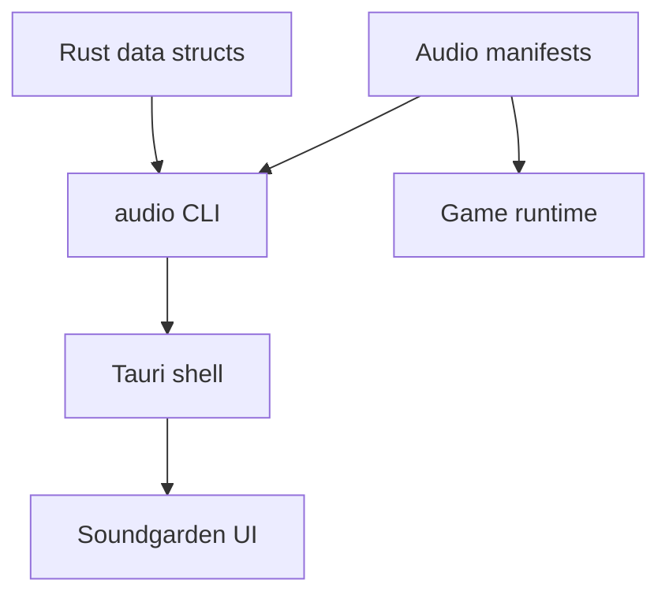
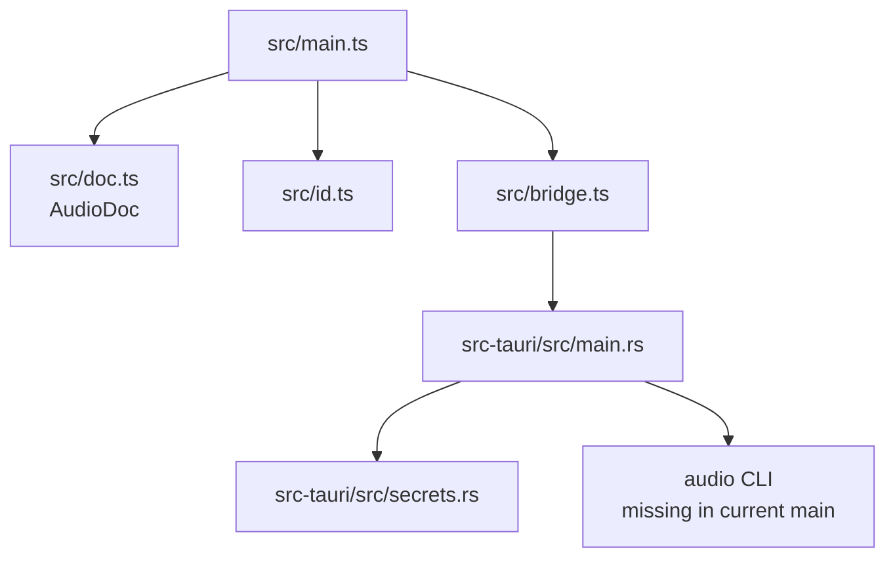
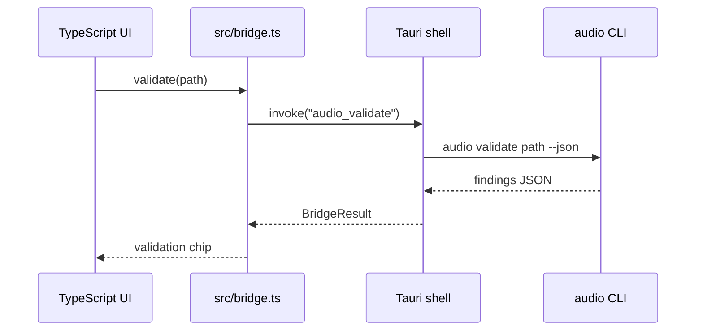
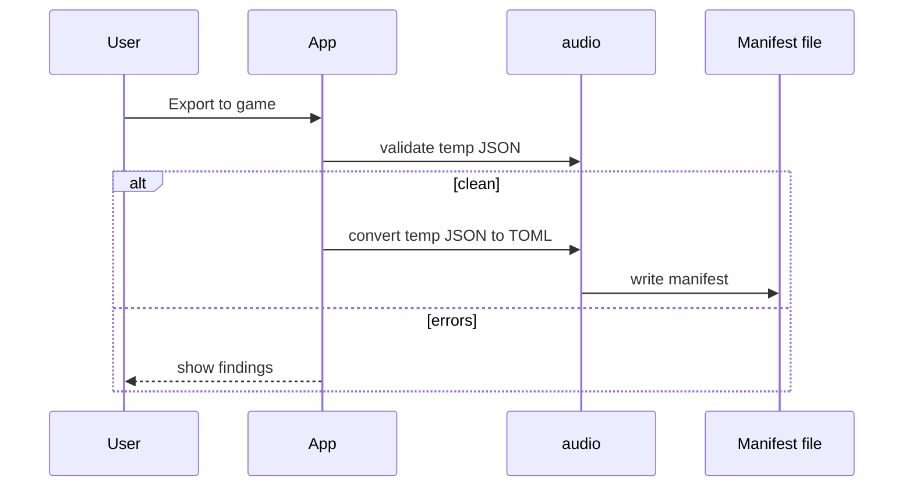
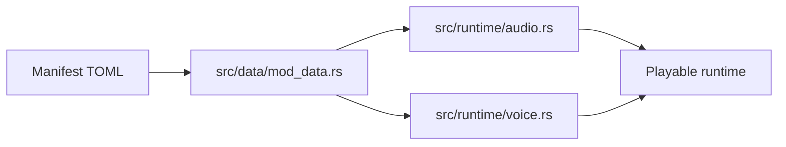

Soundgarden mirrors Leitmotif's architectural idea: a focused editor talks to a game-owned CLI contract.

## Target Shape

The target contract is:

- Rust data structs define the shape.
- `audio` parses, validates, converts, scans, and emits schema.
- Soundgarden edits JSON in memory and exports TOML through `audio`.
- The runtime reads the same TOML as before.

## Current Tool Layers

Important boundary: `src/main.ts` renders and coordinates. It should not become the owner of manifest state. `AudioDoc` owns that.

## Bridge Calls

Expected bridge commands:

| UI wrapper | Tauri command | CLI call |
| --- | --- | --- |
| `validate(path)` | `audio_validate` | `audio validate <path> --json` |
| `schema(kind)` | `audio_schema` | `audio schema --kind <kind>` |
| `assets()` | `audio_assets` | `audio assets` |
| `scan(dir)` | `audio_scan` | `audio scan [--dir]` |
| `loadManifest(path)` | `load_manifest` | `audio convert <path> <tmp.json>` |
| `saveManifest(path,json)` | `save_manifest` | `audio convert <tmp.json> <path>` |
| `exportManifest(path,json)` | `export_manifest` | validate first, then convert |

## Export Safety

Export should be validate-then-write:

This prevents the editor from writing content the game cannot parse.

## Runtime Boundary

The runtime does not know Soundgarden exists.

That is the right boundary. Soundgarden should make data safer and easier to maintain, but the game should continue to run from the manifest files.

## Open Architectural Work

Before Soundgarden can be called complete in this checkout:

1. Add or restore `src/bin/audio.rs`.
2. Ensure `Cargo.toml` declares the `audio` binary if needed.
3. Make `audio validate`, `convert`, `schema`, `assets`, and `scan` pass against current manifests.
4. Fix the `tools/soundgarden` submodule mapping or intentionally vendor it.
5. Run `npm test`, `npm run build`, and the game-side `audio` CLI checks.

