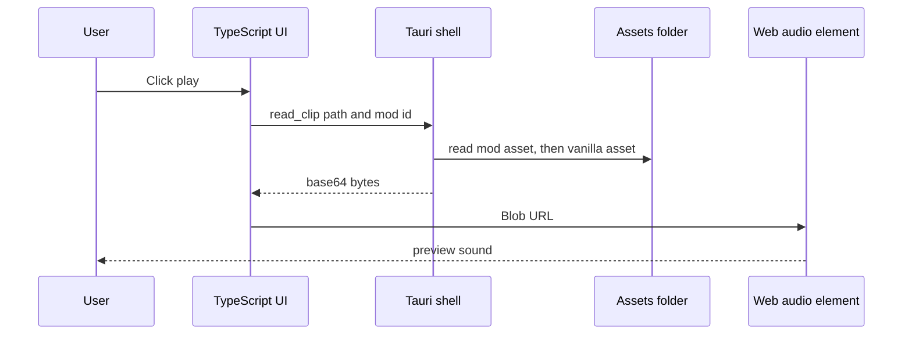
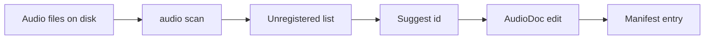
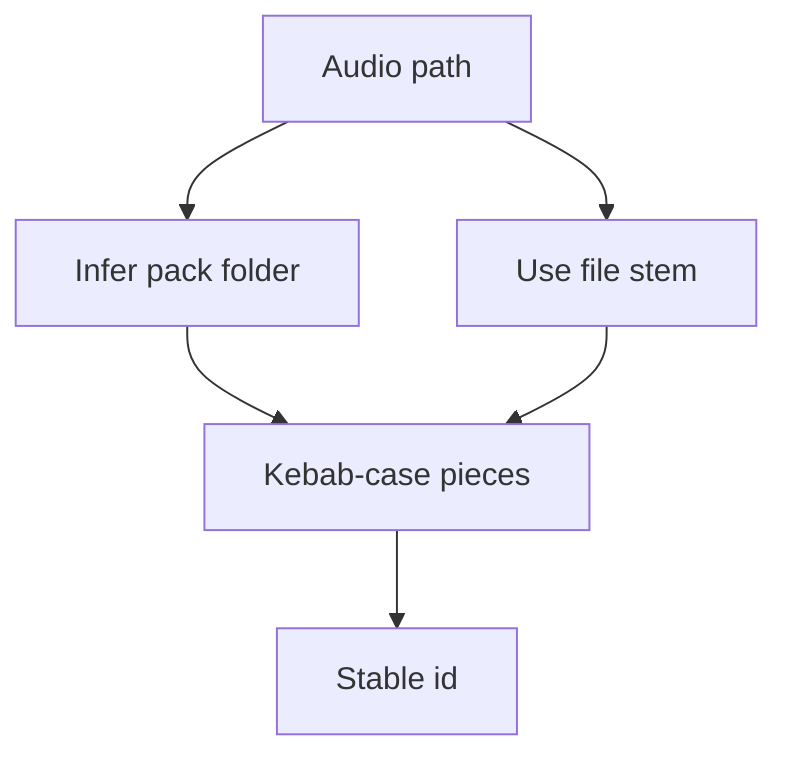

Auditioning is the small workflow that makes Soundgarden feel like an audio tool instead of a spreadsheet. The current app has the web and Tauri bridge pieces for row-level playback; the missing CLI still blocks scan and manifest workflows in this checkout.

## Playback Path



`read_clip` caps previews at 20 MB and returns an error if the clip cannot be found in the active mod or vanilla `Assets/`.

## Supported Preview Types

The web UI maps extensions to browser MIME types:

| Extension | MIME |
| --- | --- |
| `.ogg` | `audio/ogg` |
| `.wav` | `audio/wav` |
| `.mp3` | `audio/mpeg` |
| `.flac` | `audio/flac` |

The game runtime is stricter for actual playback and currently guards runtime clips to `.ogg` or `.wav`. Treat MP3/FLAC preview as an editor convenience only unless the runtime backend changes.

## Unregistered Clips

Unregistered clips are files on disk that no manifest references yet.



For SFX, adding a clip creates:

```toml
[[sfx]]
id = "gssounds-hit"
asset = "Audio/GSSounds/Hit.wav"
category = "uncategorized"
duration = 0
```

For music, adding a clip creates:

```toml
[[track]]
id = "gssounds-babis-lighthouse"
asset = "Audio/GSSounds/Music/babis_lighthouse.ogg"
loop = false
duration = 0
```

Voice manifests do not use unregistered audio clips because `voices.toml` configures procedural pseudo-speech profiles rather than file-backed clips.

## Id Suggestions

`tools/soundgarden/src/id.ts` creates kebab-case ids from asset paths.



Example:

```text
Audio/GSSounds/Hit.wav -> gssounds-hit
Audio/Foo/My Cool_Sound.wav -> foo-my-cool-sound
```

The suggestion is only a starting point. Contributors should still choose ids that remain stable once dialogue, choreography, settings, or runtime code references them.

