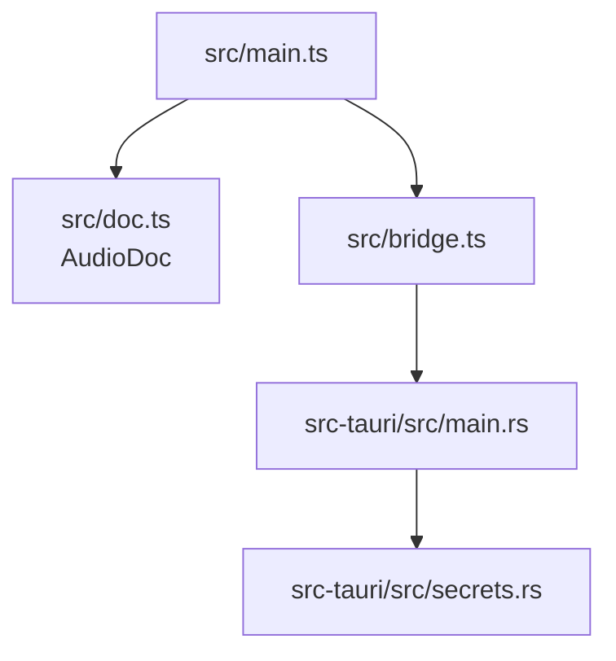
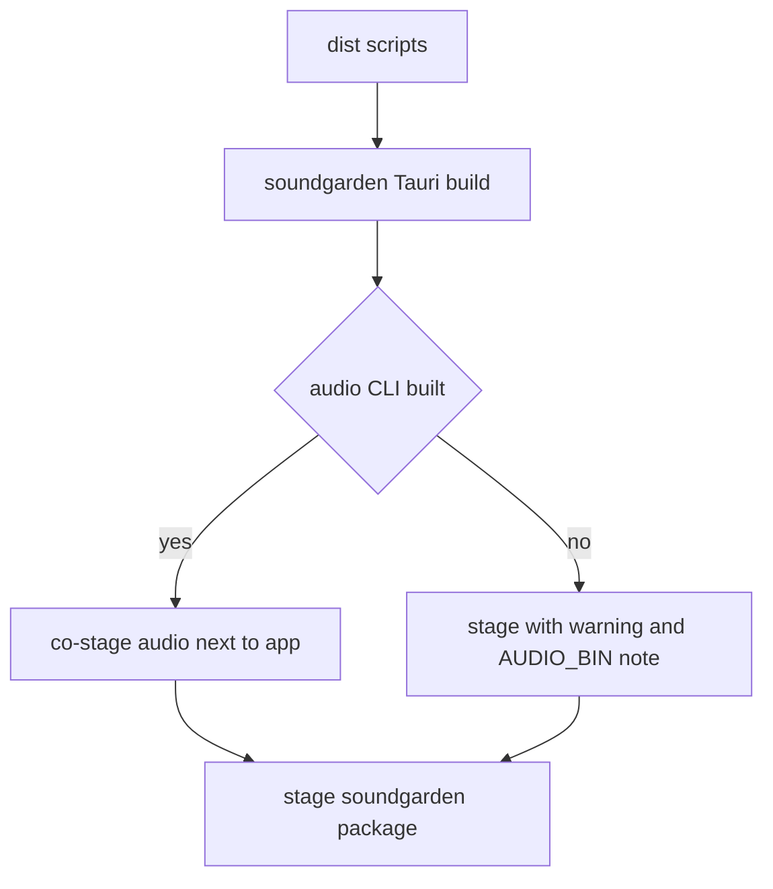

This page is deliberately conservative. It describes what exists in the current checkout, and what is still blocked.

## Available In The Game

The game already has manifest-backed audio:

| File | Runtime purpose |
| --- | --- |
| `Assets/Data/sfx.toml` | One-shot sound effects. |
| `Assets/Data/music.toml` | Long music, weather, and loop tracks. |
| `Assets/Data/voices.toml` | Pseudo-speech profiles for dialogue speakers. |

The Rust types and loaders live in `src/data/mod_data.rs`:

| Type | Data |
| --- | --- |
| `SfxDef` / `SfxManifestFile` | `[[sfx]]` entries. |
| `TrackDef` / `MusicManifestFile` | `[[track]]` entries. |
| `VoiceDef` / `VoicesFile` | `[[voice]]` entries. |

The runtime consumers are:

- `src/runtime/audio.rs`
- `src/runtime/voice.rs`

## Available In The Tool

`tools/soundgarden` contains a Tauri + Vite app.



Available code:

| Module | Purpose |
| --- | --- |
| `src/main.ts` | Library/inspector UI, unregistered list, validation chip, save/export controls. |
| `src/doc.ts` | `AudioDoc`, dirty tracking, undo/redo, lossless top-level metadata preservation. |
| `src/id.ts` | Suggested kebab-case ids from asset paths. |
| `src/bridge.ts` | Typed wrappers for expected Tauri commands. |
| `src-tauri/src/main.rs` | Native shell that expects an `audio` CLI. |
| `src-tauri/src/secrets.rs` | Gemini key lookup. |

Tests exist for the pure pieces:

```powershell
cd tools/soundgarden
npm test
```

## Expected But Missing In Current Main

The app expects a game-side CLI named `audio`.

Expected commands:

```text
audio validate <file.toml|json> [--json]
audio convert <in> <out>
audio schema --kind sfx|music|voices
audio assets
audio scan [--dir Assets/Audio]
```

In the current main checkout, `src/bin/audio.rs` is not present. That means:

- `npm run dev` can show the web UI shell, but bridge calls cannot complete.
- `npm run tauri:dev` requires an `AUDIO_BIN` that does not currently build from this main checkout.
- Open/save/export through the desktop shell is blocked until the CLI is implemented or restored.

The release scripts know about this incomplete state:



So soundgarden can now appear in the suite package even while the game-side `audio` CLI is still pending in this checkout. Treat that as a packaging convenience, not as proof that the full editor loop is complete.

## Repository Wiring Note

`tools/soundgarden` exists locally, but the parent repo currently reports:

```text
fatal: no submodule mapping found in .gitmodules for path 'tools/soundgarden'
```

Before treating Soundgarden as a reliable submodule workflow, fix the `.gitmodules` mapping or intentionally convert it to a tracked in-tree tool. Do not leave contributors guessing which model owns it.

## Safe Work Today

Good current tasks:

- Document the current manifest shapes.
- Improve pure TypeScript tests around `AudioDoc` and id generation.
- Improve UI copy and layout in web-only mode.
- Add or refine `Assets/Data/sfx.toml`, `music.toml`, or `voices.toml` entries manually.
- Implement or restore the `audio` CLI contract.

Risky current tasks:

- Claiming the full export loop works from main.
- Adding editor-only state that cannot round-trip through TOML.
- Teaching runtime code to bypass manifests.
- Storing Gemini keys in the repository.
