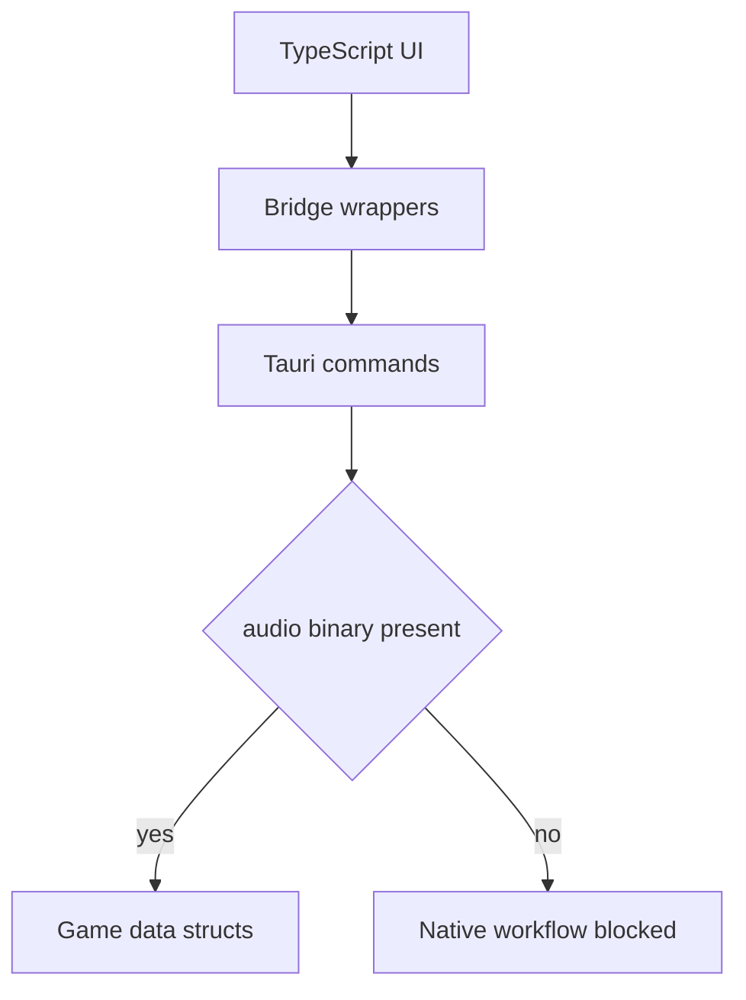
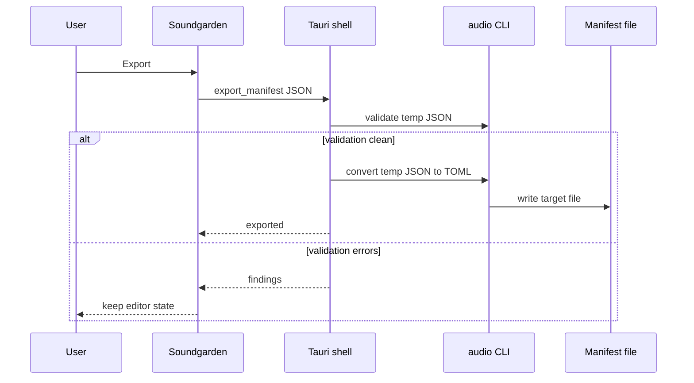

Soundgarden's desktop shell is intentionally thin. It does not parse game manifests by itself; it delegates to a game-owned `audio` binary so the editor cannot drift from the runtime data model.

## Current Status

The current main checkout does not contain `src/bin/audio.rs`. This page documents the contract that `tools/soundgarden` already calls, not a working binary in this checkout.

Until the binary is restored, pure TypeScript work is still useful, but native open, save, export, scan, mod listing, and validation will fail with the friendly bridge error.

## Command Surface

| Command | Used for |
| --- | --- |
| `audio validate <path> --json` | Machine-readable findings for the validation chip and export gate. |
| `audio convert <in> <out> [--kind <kind>]` | Lossless TOML to JSON and JSON to TOML conversion. |
| `audio schema --kind sfx|music|voices` | Manifest schema for future generated forms and validation tooling. |
| `audio assets` | Known ids, categories, durations, and other picker context. |
| `audio scan [--dir <path>] [--mod <id>]` | Audio files on disk that no manifest references. |
| `audio mods` | Installed mod ids and names for the mod selector. |
| `audio effective --kind <kind> [--mod <id>]` | Merged base plus overlay rows with enough data for provenance. |
| `audio init-mod <id> [--name <name>]` | Scaffold `Mods/<id>/mod.toml` and the expected folder shape. |

The Tauri-only `read_clip` command is not an `audio` subcommand today. It resolves bytes from `Mods/<id>/Assets/` first, then vanilla `Assets/`, and returns base64 to the web UI for preview playback.

## Validate Then Write

Export is deliberately stricter than save.

That boundary matters. A contributor can make the UI nicer without making invalid data easier to ship.

## Path Resolution

The shell uses two environment variables:

| Variable | Meaning |
| --- | --- |
| `AUDIO_BIN` | Exact binary to run. If absent, the shell tries `audio` on `PATH`. |
| `GAME_ROOT` | EchoWarrior repo root for repo-relative data reads. If absent, dev mode assumes `../..` from `tools/soundgarden`. |

This is why a Tauri launch from an IDE should set both explicitly once the CLI exists.

## Contributor Notes

- Keep parser, validator, schema, and conversion logic beside the Rust manifest structs.
- Return stable JSON shapes; the TypeScript bridge expects strings and parses JSON where needed.
- Make missing files distinguishable from malformed files. Mod mode starts an empty overlay only for missing overlay files, never for parse failures.
- Preserve top-level manifest metadata such as `schema` and `schema_version`.
- Keep errors clear enough to render directly in the status ribbon.

