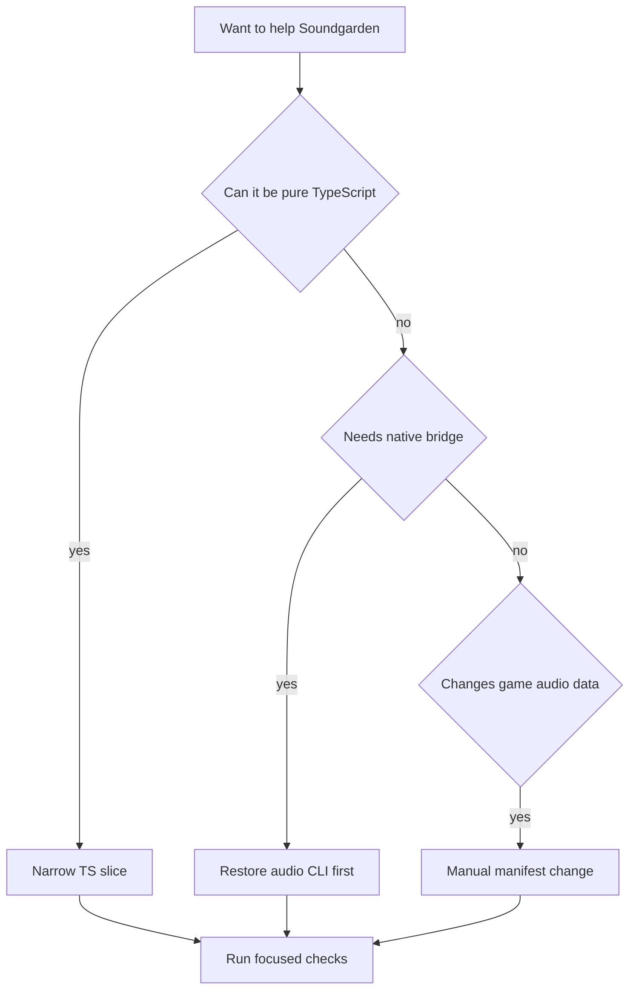

This page is for a contributor who wants to help Soundgarden without accidentally working against the current code.

## Choose A Slice



Because `src/bin/audio.rs` is missing in this checkout, pure TypeScript slices are the safest place to start.

## Good First Soundgarden Slices

| Slice | Files | Why it is safe |
| --- | --- | --- |
| Add overlay tests | `tools/soundgarden/src/overlay.test.ts` | Pure logic, no Tauri, no CLI. |
| Improve id tests | `tools/soundgarden/src/id.test.ts` | Captures naming conventions before more assets arrive. |
| Refine document round-trip tests | `tools/soundgarden/src/doc.test.ts` | Protects schema headers and `remove` lists. |
| Improve web-only empty states | `tools/soundgarden/src/main.ts`, `style.css` | Helpful even while native bridge is blocked. |
| Update manifest docs | Wiki pages plus `Assets/Data/*.toml` examples | Keeps future audio work discoverable. |

Run:

```powershell
cd tools/soundgarden
npm test
npm run build
```

## Slices That Need The CLI

These should start by restoring or implementing `src/bin/audio.rs`:

- native open/save/export
- validation chip accuracy
- unregistered clip scan
- installed mod list
- effective base-plus-overlay manifests
- `init-mod`
- schema-driven inspector forms

The bridge already names the expected commands, so the CLI can be implemented against the existing app surface instead of inventing a second contract.

## Manual Audio Manifest Change

For a small manual SFX or music edit:

1. Edit `Assets/Data/sfx.toml` or `Assets/Data/music.toml`.
2. Keep the `asset` path relative to `Assets/`.
3. Use a stable kebab-case id.
4. Prefer `.ogg` or `.wav`.
5. Run the game-side gate that exists today:

```powershell
cargo run --bin mod_check
cargo run --bin asset_pack -- --dry-run --list
```

When the `audio` CLI exists again, add `audio validate <manifest> --json` to this path.

## Avoid These

- Do not make the editor store hidden state that the TOML cannot represent.
- Do not make Soundgarden parse a second, app-only manifest shape.
- Do not let a missing overlay file and a malformed overlay file behave the same.
- Do not preview a file and assume the runtime can play it; runtime support is currently `.ogg` and `.wav`.
- Do not commit Gemini keys, generated secrets, or local app data.

