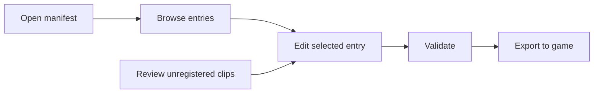
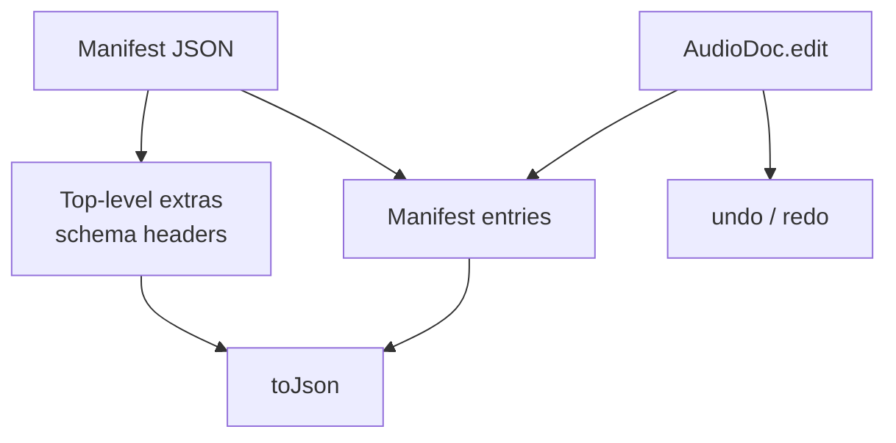
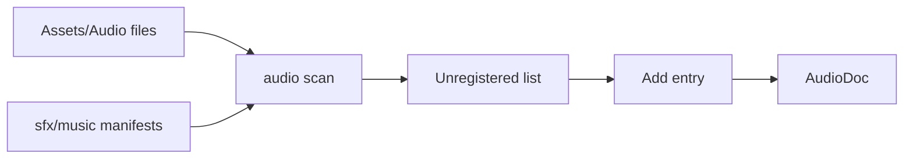
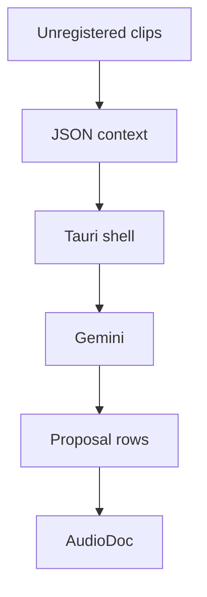

The current Soundgarden app is a Phase 1 manifest studio. It is not yet an auditioning DAW, waveform editor, or synthesis workbench.

## Intended User Flow



The UI is organized as:

| Region | Purpose |
| --- | --- |
| Header ribbon | Open, save, export, undo, redo, AI assist when available, validation counts. |
| Library | Manifest entries and unregistered clips. |
| Inspector | Editable fields for the selected manifest entry. |
| Proposal panel | Optional Gemini suggestions for unregistered clips. |

## Document Model

All edits flow through `AudioDoc`.



`AudioDoc` preserves top-level metadata that is not the entries array. This matters because `schema` and `schema_version` headers must survive a load-save round trip.

Supported manifest kinds:

- `sfx`
- `music`
- `voices`

Wire keys:

| Kind | TOML/JSON array key |
| --- | --- |
| `sfx` | `sfx` |
| `music` | `track` |
| `voices` | `voice` |

## Unregistered Clips

The app is designed to ask `audio scan` for files under `Assets/Audio` that no manifest references.



When a user clicks an unregistered clip, Soundgarden suggests an id from the path using `src/id.ts`.

Example:

```text
Audio/Kenneys/Impact Sounds/Audio/impactWood_heavy_000.ogg
```

becomes a kebab-style id like:

```text
kenneys-impactwood-heavy-000
```

The exact id can be edited after insertion.

## Optional Gemini Assist

Gemini assist is optional. If no key is configured, the button is absent and the manifest studio still works.

Key resolution order:

1. OS keychain: service `soundgarden`, account `GEMINI_API_KEY`
2. `GEMINI_API_KEY` environment variable
3. User config `secrets.toml`

The key is read by the Tauri process, not committed to the repo and not sent to the web UI.



Proposals are apply/discard rows. Applying a proposal still routes through `AudioDoc.edit`, so undo/redo works the same as manual edits.

## Current Limitation

The UI and Tauri bridge are present, but the expected `audio` CLI is absent from current main. Until that is fixed, the studio can be inspected and tested at the pure TypeScript layer, but native open/validate/scan/export behavior is blocked.

