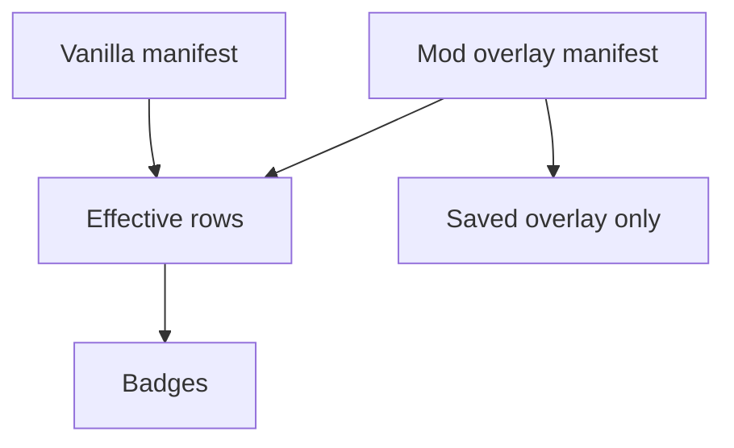
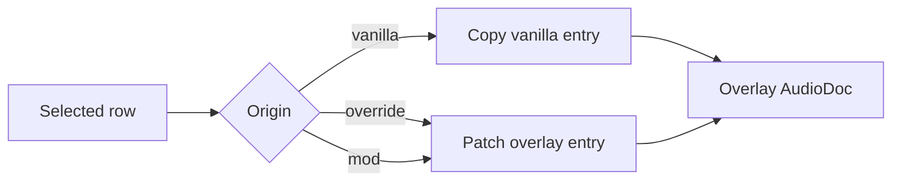
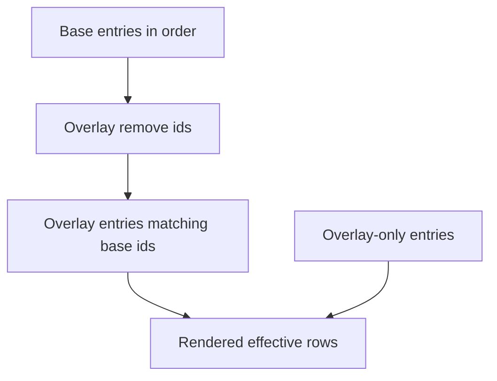

Mod authoring mode is the most important Soundgarden workflow after basic manifest editing. It lets a contributor edit a mod's audio layer without touching vanilla manifests.

## Mental Model



The effective rows are a view. The overlay file is the editable document.

## Overlay Files

Soundgarden writes one overlay file per mod and manifest kind:

```text
Mods/<mod_id>/Assets/Data/sfx.d/<mod_id>.toml
Mods/<mod_id>/Assets/Data/music.d/<mod_id>.toml
Mods/<mod_id>/Assets/Data/voices.d/<mod_id>.toml
```

The helper that builds those paths lives in `tools/soundgarden/src/modmode.ts`.

## Row Origins

`tools/soundgarden/src/overlay.ts` computes rows with three origins:

| Origin | Meaning | Edit behavior |
| --- | --- | --- |
| `vanilla` | Entry comes from the base game. | First edit copies it into the overlay. |
| `override` | Overlay entry has the same id as a vanilla entry. | Later edits patch the overlay copy. |
| `mod` | Entry exists only in the overlay. | Edits patch that mod entry. |



Every mutation still runs inside `AudioDoc.edit()`, so undo/redo and dirty tracking behave the same as vanilla editing.

## Hide And Restore

Hiding a vanilla sound does not delete the base entry. It appends the id to the overlay's `remove` list.

```toml
remove = ["ui-audio-click1"]
```

Restoring removes the id from that list.

Hidden rows remain visible as dimmed, struck-through rows in the library. This is a deliberate usability choice: a modder can see what the overlay is suppressing and undo it without opening the TOML by hand.

## Merge Order

The tested helper mirrors the intended engine merge:



Base entries keep their order. Overrides appear in the base row position. New mod entries are appended after base rows.

## Tests To Extend

Useful pure tests live in `tools/soundgarden/src/overlay.test.ts`.

Good next cases:

- an id that appears in both `remove` and overlay entries stays present as an override
- duplicate overlay ids produce a clear validation finding once the CLI exists
- voice overlays preserve the `voice` wire key
- hidden rows cannot be edited as if they were active vanilla rows

