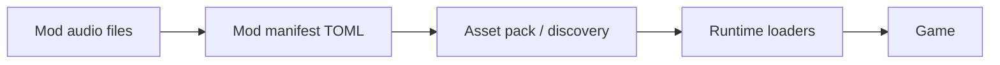
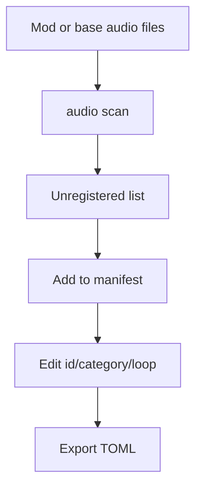
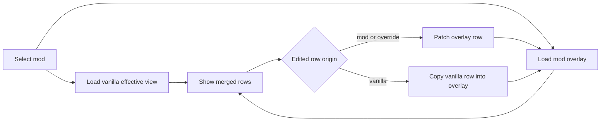

Soundgarden should preserve EchoWarrior's data-first modding model.

## Modding Principle



The editor should never make audio content depend on hidden app-only state. If a modder cannot inspect and ship the TOML, the workflow has drifted.

## What A Mod Can Add

A mod can mirror the base data layout:

```text
Mods/<mod_id>/Assets/Audio/...
Mods/<mod_id>/Assets/Data/sfx.toml
Mods/<mod_id>/Assets/Data/music.toml
Mods/<mod_id>/Assets/Data/voices.toml
Mods/<mod_id>/Assets/Data/sfx.d/<mod_id>.toml
Mods/<mod_id>/Assets/Data/music.d/<mod_id>.toml
Mods/<mod_id>/Assets/Data/voices.d/<mod_id>.toml
```

The same manifest concepts apply:

| Manifest | Mod use |
| --- | --- |
| `sfx.toml` | New one-shots, UI sounds, hits, weather stingers, creature sounds. |
| `music.toml` | New loops, ambience, intro music, gameplay tracks. |
| `voices.toml` | New or overridden pseudo-speech profiles. |
| `<kind>.d/<mod_id>.toml` | Soundgarden-owned overlay file for one mod and one manifest kind. |

## Stable Ids

Audio ids are public once referenced from code or data.

Examples:

```toml
[[sfx]]
id = "my-mod-bell-soft"
asset = "Audio/MyMod/bell_soft.ogg"
category = "rpg"
duration = 0.80
```

```toml
[[track]]
id = "my-mod-cavern-loop"
asset = "Audio/MyMod/cavern_loop.ogg"
loop = true
duration = 63.0
```

Changing ids later can break:

- dialogue commands
- choreography `play_sfx` beats
- settings track references
- runtime hard references that have not been data-driven yet

## Unregistered Clip Workflow

The planned `audio scan` flow is mod-friendly because it starts from files on disk.



The editor can suggest ids, but the manifest remains ordinary TOML.

## Overlay Editing Contract

Soundgarden should make mod edits without rewriting vanilla manifests.



The visible row can be vanilla, mod, or override. The saved file is only the overlay. That protects base game files and gives modders a small diff they can inspect.

Hiding a vanilla row writes its id to `remove`. Restoring removes that id from `remove`. Hidden vanilla rows stay visible in the tool as dimmed rows so the author can undo the decision instead of guessing what disappeared.

## AI Assist Boundaries

Gemini assist is allowed to suggest metadata. It should not become the source of truth.

Allowed:

- suggest ids
- suggest categories
- suggest `loop` values
- propose voice profile values

Not allowed:

- store API keys in git
- silently rewrite many entries without review
- invent file paths not present on disk
- bypass validation
- write app-private metadata needed by the runtime

## Validation Expectations

Once the `audio` CLI is available, validation should catch:

- duplicate ids
- non-kebab ids where the convention requires kebab-case
- missing asset files
- unsupported runtime formats
- invalid manifest kind
- malformed numeric fields
- track references that cannot be resolved

Until then, manual edits should be conservative and checked by loading the game.

## Contributor Checklist

- Keep mod audio in `Assets/Audio`-relative paths.
- Keep manifests in `Assets/Data`.
- Prefer `.ogg` or `.wav` for runtime-played clips.
- Preserve `schema` and `schema_version` headers.
- Keep `AudioDoc` round trips lossless.
- Validate with `audio validate` when the CLI exists.
- Run `cargo run --bin mod_check` for pack-level confidence.
