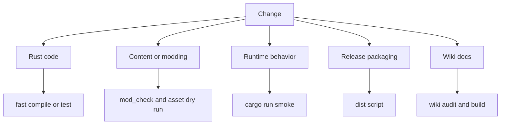
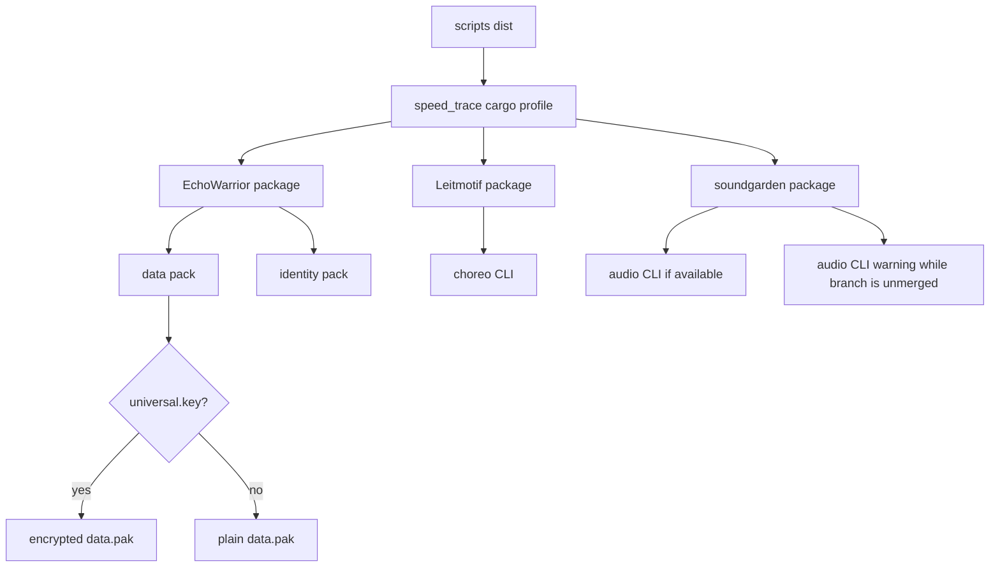
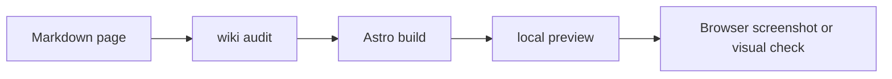

This page helps contributors choose the right check before calling a change done.



## Fast Checks

| Command | Use when |
| --- | --- |
| `cargo check` | Any Rust code changed. Fast compile sanity. |
| `cargo fmt --check` | Rust code changed or before opening a PR. |
| `cargo test --lib` | Pure library logic changed. |
| `cargo test --bin echo_warrior` | Runtime binary tests changed. |
| `cargo test -p vk2d` | Renderer crate changed or the workspace renderer dependency moved. |
| `cargo test` | Broad gate when time/environment allows. |

## Content And Modding Checks

| Command | Use when |
| --- | --- |
| `cargo run --bin mod_check` | TOML/YAML/Lua/mod/choreography/content references changed. |
| `cargo run --bin asset_pack -- --dry-run --list` | Runtime assets, manifests, mods, shaders, scripts, fonts, or dialogue changed. |
| `cargo run --bin choreo -- validate Assets/Data/scenes` | Scene project choreography changed. |
| `cargo run --bin choreo -- validate Assets/Data/choreography.toml` | Legacy choreography file changed. |

## Runtime Smoke Checks

Run the game when changing:

- rendering
- input
- audio
- runtime state transitions
- level-up or pause UI
- save/continue behavior
- shader or VFX behavior
- new runtime-loaded assets

Command:

```powershell
cargo run
```

What to check depends on the change, but report concrete observations:

- game starts
- start screen renders
- new content appears
- no obvious console errors
- target interaction works
- missing asset fallback behaves correctly

For the isolated Vulkan-facing renderer path:

```powershell
cargo run --bin wgpu_probe -- --frames 3
```

For the renderer crate by itself:

```powershell
cargo run -p vk2d --example hello_sprite -- --frames 3
```

## Release-Pack Checks

If a runtime asset path changed, verify the packed path:

```powershell
cargo run --bin asset_pack -- --dry-run --list
```

For release packaging work:

```powershell
cargo run --bin asset_pack -- --out data.pak --inventory-out asset_inventory.md --verify
cargo run --bin asset_pack -- --key universal.key --out data.pak --inventory-out asset_inventory.md --verify
```

The first command verifies a plain pack. The second verifies an encrypted pack using the current release key filename.

For encrypted source-built release packages, `universal.key` is required:
without it you can still run local compile checks and plain-pack checks, but
you have not verified the encrypted `data.pak` path the release binary must
decrypt. The no-key path remains valid when an unencrypted pack is intended.

The release scripts are the final packaging path:

```powershell
pwsh -NoLogo -File scripts/dist.ps1
```

or:

```sh
bash scripts/dist.sh
```

As of the current release pipeline, the dist scripts ship a suite, not just the game:



Use the game-only escape hatch only when the studio apps are irrelevant to the change:

```powershell
pwsh -NoLogo -File scripts/dist.ps1 -SkipTools
bash scripts/dist.sh --skip-tools
```

## Wiki Checks

For Starlight pages:

```powershell
npm run wiki:audit
npm run build
npm run dev
```

Then open the local URL printed by Astro.

Check:

- home page loads
- sidebar includes the page
- page links resolve
- Mermaid diagrams render as diagrams, not raw code blocks
- images are inside the wiki repository so Vercel can serve them



## When A Check Fails

Report:

- exact command
- exact failure summary
- whether it appears related to your change
- any environment caveat

Do not claim a check passed unless you ran it.
