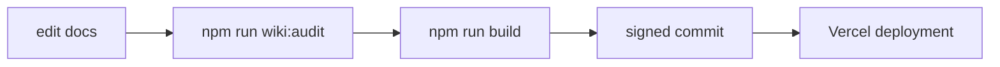
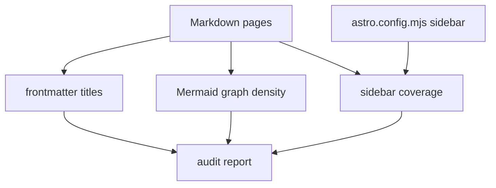
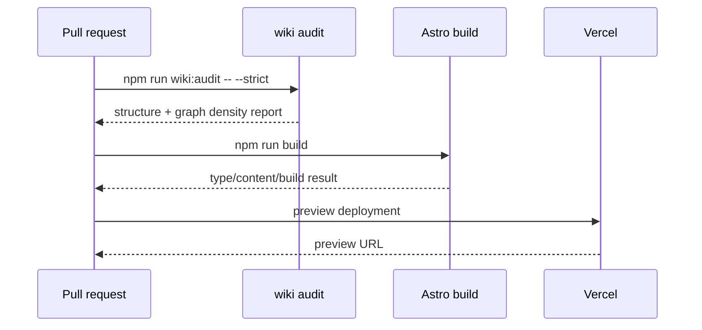

The wiki should become easier to maintain as it grows. This page documents the automation that keeps the site structured, navigable, and graph-heavy enough for complex architecture topics.

## Current Workflow



`npm run wiki:audit` runs `scripts/wiki_audit.py`. It is dependency-free and checks documentation structure before the heavier Astro build.

## What The Audit Checks



The audit reports:

- missing frontmatter titles
- sidebar slugs that do not resolve to a page
- pages that exist but are not listed in the sidebar
- complex architecture pages with fewer diagrams than the target
- the most diagram-heavy pages for quick review

## Commands

Run the normal advisory audit:

```powershell
npm run wiki:audit
```

Run the audit directly:

```powershell
py scripts/wiki_audit.py
```

Produce machine-readable JSON:

```powershell
py scripts/wiki_audit.py --json
```

Treat warnings as failures:

```powershell
py scripts/wiki_audit.py --strict
```

Adjust the graph-density target:

```powershell
py scripts/wiki_audit.py --min-complex-diagrams 3
```

## Audit Philosophy

```mermaid
flowchart TD
    simple[simple reference page]
    complex[complex architecture page]
    text[text may be enough]
    graph[needs diagrams]
    warning[advisory warning]
    strict[strict mode can fail]

    simple --> text
    complex --> graph --> warning --> strict
```

The default audit is intentionally advisory. Some reference pages do not need diagrams. Complex pages about runtime, packs, commands, modding, choreography, or protection usually do.

## CI Shape

When the wiki is ready for CI enforcement, the pipeline can become:



For now, local contributors should run the advisory audit and the build before committing wiki structure changes.
